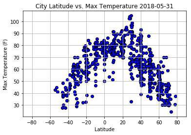
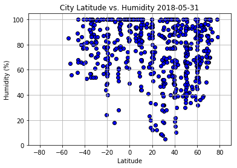
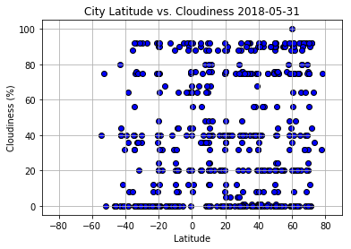
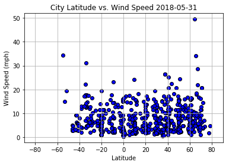

# WeatherPy

### Analysis
-  The Temperature vs Latitude graph shows a clear trend of increased temperature as latitute approaches zero, although the peak seems to be closer to 20 degrees than on the actual equator. This could be due to the axis tilt of the earth currently bringing summer temperatures to the 20th north parallel.

-  The Humidity vs Latitude graph shows that no cities outside the +-40 degree latitude range have much humidity, but the values within that range vary considerably.

-  The other plots do not show much in terms of trends towards the equator, with a pretty even distribution of values for the entire range of latitudes.


```python
#import dependencies
import arrow
import json
import requests
from keys import weather_api
from citipy import citipy
import numpy as np
import os 
import pandas as pd
import matplotlib.pyplot as plt
import openweathermapy.core as owm
```


```python
#build base URL
base_url = 'http://api.openweathermap.org/data/2.5/weather?'

```

# Generate Cities List/Perform API Calls


```python
#set lat, long ranges.  Declare lists for weather variables. Included in loop cell to make blank lists every time it's run.
lat_params = np.arange(-90, 90, 10)
long_params = np.random.uniform(-180, 180, 130)
cities = []
temperatures = []
lat_list = []
wind_list = []
humidity_list = []
cloud_list = []
city_id_list = []
date_list = []
country_list = []
long_list = []
#loop through lat, long, find nearest city, make api calls for json data
for long in long_params:
    for lat in lat_params:
        city = citipy.nearest_city(lat, long).city_name
        url = base_url + "appid=" + weather_api + "&q=" + city +"&units=imperial"
        response = requests.get(url)
        data = response.json()
        #check for duplicate cities and add city weather info to lists. try is for nonexistant city data.
        try:
            if city in cities:
                continue
            temp = data["main"]["temp_max"]
            humidity = data["main"]["humidity"]
            wind = data["wind"]["speed"]
            cloudy = data["clouds"]["all"]
            lat_list.append(data["coord"]["lat"])
            long_list.append(data["coord"]["lon"])
            date = data["dt"]
            country = data["sys"]["country"]
            country_list.append(country)
            date_list.append(date)
            temperatures.append(temp)
            humidity_list.append(humidity)
            wind_list.append(wind)
            cloud_list.append(cloudy)
            cities.append(city)
            city_id = data["id"]
            city_id_list.append(city)
        except(KeyError):
            continue
        print(f"looking up data on {city} at {url}")
        print(f"city id is {city_id}")
```

    looking up data on albany at http://api.openweathermap.org/data/2.5/weather?appid=709fc5eb59d682abe372ff731b68f9dc&q=albany&units=imperial
    city id is 5106834
    looking up data on busselton at http://api.openweathermap.org/data/2.5/weather?appid=709fc5eb59d682abe372ff731b68f9dc&q=busselton&units=imperial
    city id is 2075265
    looking up data on geraldton at http://api.openweathermap.org/data/2.5/weather?appid=709fc5eb59d682abe372ff731b68f9dc&q=geraldton&units=imperial
    city id is 5960603
    looking up data on carnarvon at http://api.openweathermap.org/data/2.5/weather?appid=709fc5eb59d682abe372ff731b68f9dc&q=carnarvon&units=imperial
    city id is 1014034
    looking up data on labuhan at http://api.openweathermap.org/data/2.5/weather?appid=709fc5eb59d682abe372ff731b68f9dc&q=labuhan&units=imperial
    city id is 1641899
    looking up data on kampot at http://api.openweathermap.org/data/2.5/weather?appid=709fc5eb59d682abe372ff731b68f9dc&q=kampot&units=imperial
    city id is 1831112
    looking up data on xam nua at http://api.openweathermap.org/data/2.5/weather?appid=709fc5eb59d682abe372ff731b68f9dc&q=xam nua&units=imperial
    city id is 1652203
    looking up data on yaan at http://api.openweathermap.org/data/2.5/weather?appid=709fc5eb59d682abe372ff731b68f9dc&q=yaan&units=imperial
    city id is 2338660
    looking up data on jinchang at http://api.openweathermap.org/data/2.5/weather?appid=709fc5eb59d682abe372ff731b68f9dc&q=jinchang&units=imperial
    city id is 1805733
    looking up data on kholtoson at http://api.openweathermap.org/data/2.5/weather?appid=709fc5eb59d682abe372ff731b68f9dc&q=kholtoson&units=imperial
    city id is 2022369
    looking up data on vanavara at http://api.openweathermap.org/data/2.5/weather?appid=709fc5eb59d682abe372ff731b68f9dc&q=vanavara&units=imperial
    city id is 2013727
    looking up data on khatanga at http://api.openweathermap.org/data/2.5/weather?appid=709fc5eb59d682abe372ff731b68f9dc&q=khatanga&units=imperial
    city id is 2022572
    looking up data on port elizabeth at http://api.openweathermap.org/data/2.5/weather?appid=709fc5eb59d682abe372ff731b68f9dc&q=port elizabeth&units=imperial
    city id is 4501427
    looking up data on port alfred at http://api.openweathermap.org/data/2.5/weather?appid=709fc5eb59d682abe372ff731b68f9dc&q=port alfred&units=imperial
    city id is 964432
    looking up data on east london at http://api.openweathermap.org/data/2.5/weather?appid=709fc5eb59d682abe372ff731b68f9dc&q=east london&units=imperial
    city id is 1006984
    looking up data on richards bay at http://api.openweathermap.org/data/2.5/weather?appid=709fc5eb59d682abe372ff731b68f9dc&q=richards bay&units=imperial
    city id is 962367
    looking up data on quelimane at http://api.openweathermap.org/data/2.5/weather?appid=709fc5eb59d682abe372ff731b68f9dc&q=quelimane&units=imperial
    city id is 1028434
    looking up data on liwale at http://api.openweathermap.org/data/2.5/weather?appid=709fc5eb59d682abe372ff731b68f9dc&q=liwale&units=imperial
    city id is 155921
    looking up data on nanyuki at http://api.openweathermap.org/data/2.5/weather?appid=709fc5eb59d682abe372ff731b68f9dc&q=nanyuki&units=imperial
    city id is 184433
    looking up data on shambu at http://api.openweathermap.org/data/2.5/weather?appid=709fc5eb59d682abe372ff731b68f9dc&q=shambu&units=imperial
    city id is 328709
    looking up data on sawakin at http://api.openweathermap.org/data/2.5/weather?appid=709fc5eb59d682abe372ff731b68f9dc&q=sawakin&units=imperial
    city id is 367544
    looking up data on bayir at http://api.openweathermap.org/data/2.5/weather?appid=709fc5eb59d682abe372ff731b68f9dc&q=bayir&units=imperial
    city id is 304183
    looking up data on sivas at http://api.openweathermap.org/data/2.5/weather?appid=709fc5eb59d682abe372ff731b68f9dc&q=sivas&units=imperial
    city id is 300617
    looking up data on prykolotne at http://api.openweathermap.org/data/2.5/weather?appid=709fc5eb59d682abe372ff731b68f9dc&q=prykolotne&units=imperial
    city id is 690193
    looking up data on kaduy at http://api.openweathermap.org/data/2.5/weather?appid=709fc5eb59d682abe372ff731b68f9dc&q=kaduy&units=imperial
    city id is 554535
    looking up data on hobart at http://api.openweathermap.org/data/2.5/weather?appid=709fc5eb59d682abe372ff731b68f9dc&q=hobart&units=imperial
    city id is 2163355
    looking up data on new norfolk at http://api.openweathermap.org/data/2.5/weather?appid=709fc5eb59d682abe372ff731b68f9dc&q=new norfolk&units=imperial
    city id is 2155415
    looking up data on mount gambier at http://api.openweathermap.org/data/2.5/weather?appid=709fc5eb59d682abe372ff731b68f9dc&q=mount gambier&units=imperial
    city id is 2156643
    looking up data on port augusta at http://api.openweathermap.org/data/2.5/weather?appid=709fc5eb59d682abe372ff731b68f9dc&q=port augusta&units=imperial
    city id is 2063056
    looking up data on mount isa at http://api.openweathermap.org/data/2.5/weather?appid=709fc5eb59d682abe372ff731b68f9dc&q=mount isa&units=imperial
    city id is 2065594
    looking up data on nhulunbuy at http://api.openweathermap.org/data/2.5/weather?appid=709fc5eb59d682abe372ff731b68f9dc&q=nhulunbuy&units=imperial
    city id is 2064735
    looking up data on biak at http://api.openweathermap.org/data/2.5/weather?appid=709fc5eb59d682abe372ff731b68f9dc&q=biak&units=imperial
    city id is 1637001
    looking up data on airai at http://api.openweathermap.org/data/2.5/weather?appid=709fc5eb59d682abe372ff731b68f9dc&q=airai&units=imperial
    city id is 1651810
    looking up data on nishihara at http://api.openweathermap.org/data/2.5/weather?appid=709fc5eb59d682abe372ff731b68f9dc&q=nishihara&units=imperial
    city id is 1850144
    looking up data on shingu at http://api.openweathermap.org/data/2.5/weather?appid=709fc5eb59d682abe372ff731b68f9dc&q=shingu&units=imperial
    city id is 1847947
    looking up data on ryotsu at http://api.openweathermap.org/data/2.5/weather?appid=709fc5eb59d682abe372ff731b68f9dc&q=ryotsu&units=imperial
    city id is 1853371
    looking up data on amursk at http://api.openweathermap.org/data/2.5/weather?appid=709fc5eb59d682abe372ff731b68f9dc&q=amursk&units=imperial
    city id is 2027749
    looking up data on solnechnyy at http://api.openweathermap.org/data/2.5/weather?appid=709fc5eb59d682abe372ff731b68f9dc&q=solnechnyy&units=imperial
    city id is 2016307
    looking up data on ust-kuyga at http://api.openweathermap.org/data/2.5/weather?appid=709fc5eb59d682abe372ff731b68f9dc&q=ust-kuyga&units=imperial
    city id is 2013921
    looking up data on punta arenas at http://api.openweathermap.org/data/2.5/weather?appid=709fc5eb59d682abe372ff731b68f9dc&q=punta arenas&units=imperial
    city id is 3874787
    looking up data on rikitea at http://api.openweathermap.org/data/2.5/weather?appid=709fc5eb59d682abe372ff731b68f9dc&q=rikitea&units=imperial
    city id is 4030556
    looking up data on san patricio at http://api.openweathermap.org/data/2.5/weather?appid=709fc5eb59d682abe372ff731b68f9dc&q=san patricio&units=imperial
    city id is 3437029
    looking up data on cabo san lucas at http://api.openweathermap.org/data/2.5/weather?appid=709fc5eb59d682abe372ff731b68f9dc&q=cabo san lucas&units=imperial
    city id is 3985710
    looking up data on san felipe at http://api.openweathermap.org/data/2.5/weather?appid=709fc5eb59d682abe372ff731b68f9dc&q=san felipe&units=imperial
    city id is 3872255
    looking up data on west wendover at http://api.openweathermap.org/data/2.5/weather?appid=709fc5eb59d682abe372ff731b68f9dc&q=west wendover&units=imperial
    city id is 5710035
    looking up data on blairmore at http://api.openweathermap.org/data/2.5/weather?appid=709fc5eb59d682abe372ff731b68f9dc&q=blairmore&units=imperial
    city id is 5903535
    looking up data on hay river at http://api.openweathermap.org/data/2.5/weather?appid=709fc5eb59d682abe372ff731b68f9dc&q=hay river&units=imperial
    city id is 5972762
    looking up data on yellowknife at http://api.openweathermap.org/data/2.5/weather?appid=709fc5eb59d682abe372ff731b68f9dc&q=yellowknife&units=imperial
    city id is 6185377
    looking up data on saint-philippe at http://api.openweathermap.org/data/2.5/weather?appid=709fc5eb59d682abe372ff731b68f9dc&q=saint-philippe&units=imperial
    city id is 6138908
    looking up data on souillac at http://api.openweathermap.org/data/2.5/weather?appid=709fc5eb59d682abe372ff731b68f9dc&q=souillac&units=imperial
    city id is 3026644
    looking up data on victoria at http://api.openweathermap.org/data/2.5/weather?appid=709fc5eb59d682abe372ff731b68f9dc&q=victoria&units=imperial
    city id is 1733782
    looking up data on kavaratti at http://api.openweathermap.org/data/2.5/weather?appid=709fc5eb59d682abe372ff731b68f9dc&q=kavaratti&units=imperial
    city id is 1267390
    looking up data on sur at http://api.openweathermap.org/data/2.5/weather?appid=709fc5eb59d682abe372ff731b68f9dc&q=sur&units=imperial
    city id is 286245
    looking up data on seydi at http://api.openweathermap.org/data/2.5/weather?appid=709fc5eb59d682abe372ff731b68f9dc&q=seydi&units=imperial
    city id is 2448024
    looking up data on gari at http://api.openweathermap.org/data/2.5/weather?appid=709fc5eb59d682abe372ff731b68f9dc&q=gari&units=imperial
    city id is 1506676
    looking up data on ushuaia at http://api.openweathermap.org/data/2.5/weather?appid=709fc5eb59d682abe372ff731b68f9dc&q=ushuaia&units=imperial
    city id is 3833367
    looking up data on cape town at http://api.openweathermap.org/data/2.5/weather?appid=709fc5eb59d682abe372ff731b68f9dc&q=cape town&units=imperial
    city id is 3369157
    looking up data on jamestown at http://api.openweathermap.org/data/2.5/weather?appid=709fc5eb59d682abe372ff731b68f9dc&q=jamestown&units=imperial
    city id is 2069194
    looking up data on georgetown at http://api.openweathermap.org/data/2.5/weather?appid=709fc5eb59d682abe372ff731b68f9dc&q=georgetown&units=imperial
    city id is 3378644
    looking up data on monrovia at http://api.openweathermap.org/data/2.5/weather?appid=709fc5eb59d682abe372ff731b68f9dc&q=monrovia&units=imperial
    city id is 2274895
    looking up data on boffa at http://api.openweathermap.org/data/2.5/weather?appid=709fc5eb59d682abe372ff731b68f9dc&q=boffa&units=imperial
    city id is 2422968
    looking up data on atar at http://api.openweathermap.org/data/2.5/weather?appid=709fc5eb59d682abe372ff731b68f9dc&q=atar&units=imperial
    city id is 2381334
    looking up data on teguise at http://api.openweathermap.org/data/2.5/weather?appid=709fc5eb59d682abe372ff731b68f9dc&q=teguise&units=imperial
    city id is 2510573
    looking up data on peniche at http://api.openweathermap.org/data/2.5/weather?appid=709fc5eb59d682abe372ff731b68f9dc&q=peniche&units=imperial
    city id is 2264923
    looking up data on dingle at http://api.openweathermap.org/data/2.5/weather?appid=709fc5eb59d682abe372ff731b68f9dc&q=dingle&units=imperial
    city id is 1714733
    looking up data on hofn at http://api.openweathermap.org/data/2.5/weather?appid=709fc5eb59d682abe372ff731b68f9dc&q=hofn&units=imperial
    city id is 2630299
    looking up data on husavik at http://api.openweathermap.org/data/2.5/weather?appid=709fc5eb59d682abe372ff731b68f9dc&q=husavik&units=imperial
    city id is 5961417
    looking up data on atuona at http://api.openweathermap.org/data/2.5/weather?appid=709fc5eb59d682abe372ff731b68f9dc&q=atuona&units=imperial
    city id is 4020109
    looking up data on hilo at http://api.openweathermap.org/data/2.5/weather?appid=709fc5eb59d682abe372ff731b68f9dc&q=hilo&units=imperial
    city id is 5855927
    looking up data on fortuna at http://api.openweathermap.org/data/2.5/weather?appid=709fc5eb59d682abe372ff731b68f9dc&q=fortuna&units=imperial
    city id is 2517679
    looking up data on sitka at http://api.openweathermap.org/data/2.5/weather?appid=709fc5eb59d682abe372ff731b68f9dc&q=sitka&units=imperial
    city id is 4267710
    looking up data on haines junction at http://api.openweathermap.org/data/2.5/weather?appid=709fc5eb59d682abe372ff731b68f9dc&q=haines junction&units=imperial
    city id is 5969025
    looking up data on aklavik at http://api.openweathermap.org/data/2.5/weather?appid=709fc5eb59d682abe372ff731b68f9dc&q=aklavik&units=imperial
    city id is 5882953
    looking up data on tuktoyaktuk at http://api.openweathermap.org/data/2.5/weather?appid=709fc5eb59d682abe372ff731b68f9dc&q=tuktoyaktuk&units=imperial
    city id is 6170031
    looking up data on ballitoville at http://api.openweathermap.org/data/2.5/weather?appid=709fc5eb59d682abe372ff731b68f9dc&q=ballitoville&units=imperial
    city id is 1021360
    looking up data on chipinge at http://api.openweathermap.org/data/2.5/weather?appid=709fc5eb59d682abe372ff731b68f9dc&q=chipinge&units=imperial
    city id is 893549
    looking up data on mungwi at http://api.openweathermap.org/data/2.5/weather?appid=709fc5eb59d682abe372ff731b68f9dc&q=mungwi&units=imperial
    city id is 904241
    looking up data on lukaya at http://api.openweathermap.org/data/2.5/weather?appid=709fc5eb59d682abe372ff731b68f9dc&q=lukaya&units=imperial
    city id is 232490
    looking up data on marawi at http://api.openweathermap.org/data/2.5/weather?appid=709fc5eb59d682abe372ff731b68f9dc&q=marawi&units=imperial
    city id is 1701054
    looking up data on suez at http://api.openweathermap.org/data/2.5/weather?appid=709fc5eb59d682abe372ff731b68f9dc&q=suez&units=imperial
    city id is 359796
    looking up data on bolu at http://api.openweathermap.org/data/2.5/weather?appid=709fc5eb59d682abe372ff731b68f9dc&q=bolu&units=imperial
    city id is 750510
    looking up data on drabiv at http://api.openweathermap.org/data/2.5/weather?appid=709fc5eb59d682abe372ff731b68f9dc&q=drabiv&units=imperial
    city id is 709643
    looking up data on novaya ladoga at http://api.openweathermap.org/data/2.5/weather?appid=709fc5eb59d682abe372ff731b68f9dc&q=novaya ladoga&units=imperial
    city id is 519630
    looking up data on pechenga at http://api.openweathermap.org/data/2.5/weather?appid=709fc5eb59d682abe372ff731b68f9dc&q=pechenga&units=imperial
    city id is 511866
    looking up data on berlevag at http://api.openweathermap.org/data/2.5/weather?appid=709fc5eb59d682abe372ff731b68f9dc&q=berlevag&units=imperial
    city id is 780687
    looking up data on castro at http://api.openweathermap.org/data/2.5/weather?appid=709fc5eb59d682abe372ff731b68f9dc&q=castro&units=imperial
    city id is 3896218
    looking up data on ancud at http://api.openweathermap.org/data/2.5/weather?appid=709fc5eb59d682abe372ff731b68f9dc&q=ancud&units=imperial
    city id is 3899695
    looking up data on lebu at http://api.openweathermap.org/data/2.5/weather?appid=709fc5eb59d682abe372ff731b68f9dc&q=lebu&units=imperial
    city id is 344979
    looking up data on pisco at http://api.openweathermap.org/data/2.5/weather?appid=709fc5eb59d682abe372ff731b68f9dc&q=pisco&units=imperial
    city id is 3932145
    looking up data on san cristobal at http://api.openweathermap.org/data/2.5/weather?appid=709fc5eb59d682abe372ff731b68f9dc&q=san cristobal&units=imperial
    city id is 3652462
    looking up data on puerto ayora at http://api.openweathermap.org/data/2.5/weather?appid=709fc5eb59d682abe372ff731b68f9dc&q=puerto ayora&units=imperial
    city id is 3652764
    looking up data on acajutla at http://api.openweathermap.org/data/2.5/weather?appid=709fc5eb59d682abe372ff731b68f9dc&q=acajutla&units=imperial
    city id is 3587498
    looking up data on campeche at http://api.openweathermap.org/data/2.5/weather?appid=709fc5eb59d682abe372ff731b68f9dc&q=campeche&units=imperial
    city id is 3531732
    looking up data on laplace at http://api.openweathermap.org/data/2.5/weather?appid=709fc5eb59d682abe372ff731b68f9dc&q=laplace&units=imperial
    city id is 4339881
    looking up data on jacksonville at http://api.openweathermap.org/data/2.5/weather?appid=709fc5eb59d682abe372ff731b68f9dc&q=jacksonville&units=imperial
    city id is 4160021
    looking up data on sioux lookout at http://api.openweathermap.org/data/2.5/weather?appid=709fc5eb59d682abe372ff731b68f9dc&q=sioux lookout&units=imperial
    city id is 6148373
    looking up data on thompson at http://api.openweathermap.org/data/2.5/weather?appid=709fc5eb59d682abe372ff731b68f9dc&q=thompson&units=imperial
    city id is 6165406
    looking up data on qaanaaq at http://api.openweathermap.org/data/2.5/weather?appid=709fc5eb59d682abe372ff731b68f9dc&q=qaanaaq&units=imperial
    city id is 3831208
    looking up data on chinsali at http://api.openweathermap.org/data/2.5/weather?appid=709fc5eb59d682abe372ff731b68f9dc&q=chinsali&units=imperial
    city id is 918905
    looking up data on ankara at http://api.openweathermap.org/data/2.5/weather?appid=709fc5eb59d682abe372ff731b68f9dc&q=ankara&units=imperial
    city id is 323786
    looking up data on miandrivazo at http://api.openweathermap.org/data/2.5/weather?appid=709fc5eb59d682abe372ff731b68f9dc&q=miandrivazo&units=imperial
    city id is 1059051
    looking up data on najran at http://api.openweathermap.org/data/2.5/weather?appid=709fc5eb59d682abe372ff731b68f9dc&q=najran&units=imperial
    city id is 103630
    looking up data on doha at http://api.openweathermap.org/data/2.5/weather?appid=709fc5eb59d682abe372ff731b68f9dc&q=doha&units=imperial
    city id is 290030
    looking up data on jermuk at http://api.openweathermap.org/data/2.5/weather?appid=709fc5eb59d682abe372ff731b68f9dc&q=jermuk&units=imperial
    city id is 174884
    looking up data on kamyshin at http://api.openweathermap.org/data/2.5/weather?appid=709fc5eb59d682abe372ff731b68f9dc&q=kamyshin&units=imperial
    city id is 553287
    looking up data on kichmengskiy gorodok at http://api.openweathermap.org/data/2.5/weather?appid=709fc5eb59d682abe372ff731b68f9dc&q=kichmengskiy gorodok&units=imperial
    city id is 548791
    looking up data on mezen at http://api.openweathermap.org/data/2.5/weather?appid=709fc5eb59d682abe372ff731b68f9dc&q=mezen&units=imperial
    city id is 527321
    looking up data on betafo at http://api.openweathermap.org/data/2.5/weather?appid=709fc5eb59d682abe372ff731b68f9dc&q=betafo&units=imperial
    city id is 1066514
    looking up data on mogadishu at http://api.openweathermap.org/data/2.5/weather?appid=709fc5eb59d682abe372ff731b68f9dc&q=mogadishu&units=imperial
    city id is 53654
    looking up data on xocali at http://api.openweathermap.org/data/2.5/weather?appid=709fc5eb59d682abe372ff731b68f9dc&q=xocali&units=imperial
    city id is 147774
    looking up data on pallasovka at http://api.openweathermap.org/data/2.5/weather?appid=709fc5eb59d682abe372ff731b68f9dc&q=pallasovka&units=imperial
    city id is 513042
    looking up data on podosinovets at http://api.openweathermap.org/data/2.5/weather?appid=709fc5eb59d682abe372ff731b68f9dc&q=podosinovets&units=imperial
    city id is 508068
    looking up data on rawson at http://api.openweathermap.org/data/2.5/weather?appid=709fc5eb59d682abe372ff731b68f9dc&q=rawson&units=imperial
    city id is 3839307
    looking up data on mar del plata at http://api.openweathermap.org/data/2.5/weather?appid=709fc5eb59d682abe372ff731b68f9dc&q=mar del plata&units=imperial
    city id is 3863379
    looking up data on quarai at http://api.openweathermap.org/data/2.5/weather?appid=709fc5eb59d682abe372ff731b68f9dc&q=quarai&units=imperial
    city id is 3452179
    looking up data on miranda at http://api.openweathermap.org/data/2.5/weather?appid=709fc5eb59d682abe372ff731b68f9dc&q=miranda&units=imperial
    city id is 3674702
    looking up data on alta floresta at http://api.openweathermap.org/data/2.5/weather?appid=709fc5eb59d682abe372ff731b68f9dc&q=alta floresta&units=imperial
    city id is 6316343
    looking up data on oriximina at http://api.openweathermap.org/data/2.5/weather?appid=709fc5eb59d682abe372ff731b68f9dc&q=oriximina&units=imperial
    city id is 3393471
    looking up data on codrington at http://api.openweathermap.org/data/2.5/weather?appid=709fc5eb59d682abe372ff731b68f9dc&q=codrington&units=imperial
    city id is 2160063
    looking up data on saint george at http://api.openweathermap.org/data/2.5/weather?appid=709fc5eb59d682abe372ff731b68f9dc&q=saint george&units=imperial
    city id is 262462
    looking up data on saint-pierre at http://api.openweathermap.org/data/2.5/weather?appid=709fc5eb59d682abe372ff731b68f9dc&q=saint-pierre&units=imperial
    city id is 2995603
    looking up data on springdale at http://api.openweathermap.org/data/2.5/weather?appid=709fc5eb59d682abe372ff731b68f9dc&q=springdale&units=imperial
    city id is 4132093
    looking up data on nuuk at http://api.openweathermap.org/data/2.5/weather?appid=709fc5eb59d682abe372ff731b68f9dc&q=nuuk&units=imperial
    city id is 3421319
    looking up data on upernavik at http://api.openweathermap.org/data/2.5/weather?appid=709fc5eb59d682abe372ff731b68f9dc&q=upernavik&units=imperial
    city id is 3418910
    looking up data on necochea at http://api.openweathermap.org/data/2.5/weather?appid=709fc5eb59d682abe372ff731b68f9dc&q=necochea&units=imperial
    city id is 3430443
    looking up data on bella union at http://api.openweathermap.org/data/2.5/weather?appid=709fc5eb59d682abe372ff731b68f9dc&q=bella union&units=imperial
    city id is 3681990
    looking up data on ladario at http://api.openweathermap.org/data/2.5/weather?appid=709fc5eb59d682abe372ff731b68f9dc&q=ladario&units=imperial
    city id is 2732265
    looking up data on terra santa at http://api.openweathermap.org/data/2.5/weather?appid=709fc5eb59d682abe372ff731b68f9dc&q=terra santa&units=imperial
    city id is 3386467
    looking up data on mabaruma at http://api.openweathermap.org/data/2.5/weather?appid=709fc5eb59d682abe372ff731b68f9dc&q=mabaruma&units=imperial
    city id is 3377301
    looking up data on deer lake at http://api.openweathermap.org/data/2.5/weather?appid=709fc5eb59d682abe372ff731b68f9dc&q=deer lake&units=imperial
    city id is 5937252
    looking up data on portland at http://api.openweathermap.org/data/2.5/weather?appid=709fc5eb59d682abe372ff731b68f9dc&q=portland&units=imperial
    city id is 5746545
    looking up data on port lincoln at http://api.openweathermap.org/data/2.5/weather?appid=709fc5eb59d682abe372ff731b68f9dc&q=port lincoln&units=imperial
    city id is 2063036
    looking up data on flinders at http://api.openweathermap.org/data/2.5/weather?appid=709fc5eb59d682abe372ff731b68f9dc&q=flinders&units=imperial
    city id is 6255012
    looking up data on alice springs at http://api.openweathermap.org/data/2.5/weather?appid=709fc5eb59d682abe372ff731b68f9dc&q=alice springs&units=imperial
    city id is 2077895
    looking up data on maningrida at http://api.openweathermap.org/data/2.5/weather?appid=709fc5eb59d682abe372ff731b68f9dc&q=maningrida&units=imperial
    city id is 2067089
    looking up data on manokwari at http://api.openweathermap.org/data/2.5/weather?appid=709fc5eb59d682abe372ff731b68f9dc&q=manokwari&units=imperial
    city id is 1636308
    looking up data on muroto at http://api.openweathermap.org/data/2.5/weather?appid=709fc5eb59d682abe372ff731b68f9dc&q=muroto&units=imperial
    city id is 1856392
    looking up data on preobrazheniye at http://api.openweathermap.org/data/2.5/weather?appid=709fc5eb59d682abe372ff731b68f9dc&q=preobrazheniye&units=imperial
    city id is 2017658
    looking up data on litovko at http://api.openweathermap.org/data/2.5/weather?appid=709fc5eb59d682abe372ff731b68f9dc&q=litovko&units=imperial
    city id is 2020738
    looking up data on ust-maya at http://api.openweathermap.org/data/2.5/weather?appid=709fc5eb59d682abe372ff731b68f9dc&q=ust-maya&units=imperial
    city id is 2013918
    looking up data on luang prabang at http://api.openweathermap.org/data/2.5/weather?appid=709fc5eb59d682abe372ff731b68f9dc&q=luang prabang&units=imperial
    city id is 1655559
    looking up data on mataura at http://api.openweathermap.org/data/2.5/weather?appid=709fc5eb59d682abe372ff731b68f9dc&q=mataura&units=imperial
    city id is 6201424
    looking up data on moerai at http://api.openweathermap.org/data/2.5/weather?appid=709fc5eb59d682abe372ff731b68f9dc&q=moerai&units=imperial
    city id is 4034188
    looking up data on faanui at http://api.openweathermap.org/data/2.5/weather?appid=709fc5eb59d682abe372ff731b68f9dc&q=faanui&units=imperial
    city id is 4034551
    looking up data on kahului at http://api.openweathermap.org/data/2.5/weather?appid=709fc5eb59d682abe372ff731b68f9dc&q=kahului&units=imperial
    city id is 5847411
    looking up data on kodiak at http://api.openweathermap.org/data/2.5/weather?appid=709fc5eb59d682abe372ff731b68f9dc&q=kodiak&units=imperial
    city id is 4407665
    looking up data on homer at http://api.openweathermap.org/data/2.5/weather?appid=709fc5eb59d682abe372ff731b68f9dc&q=homer&units=imperial
    city id is 5864145
    looking up data on barrow at http://api.openweathermap.org/data/2.5/weather?appid=709fc5eb59d682abe372ff731b68f9dc&q=barrow&units=imperial
    city id is 3833859
    looking up data on burnie at http://api.openweathermap.org/data/2.5/weather?appid=709fc5eb59d682abe372ff731b68f9dc&q=burnie&units=imperial
    city id is 2173125
    looking up data on broken hill at http://api.openweathermap.org/data/2.5/weather?appid=709fc5eb59d682abe372ff731b68f9dc&q=broken hill&units=imperial
    city id is 2173911
    looking up data on charters towers at http://api.openweathermap.org/data/2.5/weather?appid=709fc5eb59d682abe372ff731b68f9dc&q=charters towers&units=imperial
    city id is 2171722
    looking up data on daru at http://api.openweathermap.org/data/2.5/weather?appid=709fc5eb59d682abe372ff731b68f9dc&q=daru&units=imperial
    city id is 2409663
    looking up data on lorengau at http://api.openweathermap.org/data/2.5/weather?appid=709fc5eb59d682abe372ff731b68f9dc&q=lorengau&units=imperial
    city id is 2092164
    looking up data on tateyama at http://api.openweathermap.org/data/2.5/weather?appid=709fc5eb59d682abe372ff731b68f9dc&q=tateyama&units=imperial
    city id is 1849876
    looking up data on katsuura at http://api.openweathermap.org/data/2.5/weather?appid=709fc5eb59d682abe372ff731b68f9dc&q=katsuura&units=imperial
    city id is 1865309
    looking up data on kushiro at http://api.openweathermap.org/data/2.5/weather?appid=709fc5eb59d682abe372ff731b68f9dc&q=kushiro&units=imperial
    city id is 2129072
    looking up data on poronaysk at http://api.openweathermap.org/data/2.5/weather?appid=709fc5eb59d682abe372ff731b68f9dc&q=poronaysk&units=imperial
    city id is 2121909
    looking up data on okhotsk at http://api.openweathermap.org/data/2.5/weather?appid=709fc5eb59d682abe372ff731b68f9dc&q=okhotsk&units=imperial
    city id is 2122605
    looking up data on belaya gora at http://api.openweathermap.org/data/2.5/weather?appid=709fc5eb59d682abe372ff731b68f9dc&q=belaya gora&units=imperial
    city id is 2126785
    looking up data on chokurdakh at http://api.openweathermap.org/data/2.5/weather?appid=709fc5eb59d682abe372ff731b68f9dc&q=chokurdakh&units=imperial
    city id is 2126123
    looking up data on avarua at http://api.openweathermap.org/data/2.5/weather?appid=709fc5eb59d682abe372ff731b68f9dc&q=avarua&units=imperial
    city id is 4035715
    looking up data on alofi at http://api.openweathermap.org/data/2.5/weather?appid=709fc5eb59d682abe372ff731b68f9dc&q=alofi&units=imperial
    city id is 4036284
    looking up data on makakilo city at http://api.openweathermap.org/data/2.5/weather?appid=709fc5eb59d682abe372ff731b68f9dc&q=makakilo city&units=imperial
    city id is 5850554
    looking up data on kapaa at http://api.openweathermap.org/data/2.5/weather?appid=709fc5eb59d682abe372ff731b68f9dc&q=kapaa&units=imperial
    city id is 5848280
    looking up data on bethel at http://api.openweathermap.org/data/2.5/weather?appid=709fc5eb59d682abe372ff731b68f9dc&q=bethel&units=imperial
    city id is 5880568
    looking up data on nome at http://api.openweathermap.org/data/2.5/weather?appid=709fc5eb59d682abe372ff731b68f9dc&q=nome&units=imperial
    city id is 4732862
    looking up data on valdivia at http://api.openweathermap.org/data/2.5/weather?appid=709fc5eb59d682abe372ff731b68f9dc&q=valdivia&units=imperial
    city id is 3868707
    looking up data on coquimbo at http://api.openweathermap.org/data/2.5/weather?appid=709fc5eb59d682abe372ff731b68f9dc&q=coquimbo&units=imperial
    city id is 3893629
    looking up data on ilo at http://api.openweathermap.org/data/2.5/weather?appid=709fc5eb59d682abe372ff731b68f9dc&q=ilo&units=imperial
    city id is 3938415
    looking up data on satipo at http://api.openweathermap.org/data/2.5/weather?appid=709fc5eb59d682abe372ff731b68f9dc&q=satipo&units=imperial
    city id is 3928924
    looking up data on puerto leguizamo at http://api.openweathermap.org/data/2.5/weather?appid=709fc5eb59d682abe372ff731b68f9dc&q=puerto leguizamo&units=imperial
    city id is 3671437
    looking up data on bosconia at http://api.openweathermap.org/data/2.5/weather?appid=709fc5eb59d682abe372ff731b68f9dc&q=bosconia&units=imperial
    city id is 3775850
    looking up data on baracoa at http://api.openweathermap.org/data/2.5/weather?appid=709fc5eb59d682abe372ff731b68f9dc&q=baracoa&units=imperial
    city id is 3567834
    looking up data on marsh harbour at http://api.openweathermap.org/data/2.5/weather?appid=709fc5eb59d682abe372ff731b68f9dc&q=marsh harbour&units=imperial
    city id is 3571913
    looking up data on point pleasant at http://api.openweathermap.org/data/2.5/weather?appid=709fc5eb59d682abe372ff731b68f9dc&q=point pleasant&units=imperial
    city id is 5102796
    looking up data on chapais at http://api.openweathermap.org/data/2.5/weather?appid=709fc5eb59d682abe372ff731b68f9dc&q=chapais&units=imperial
    city id is 5919850
    looking up data on iqaluit at http://api.openweathermap.org/data/2.5/weather?appid=709fc5eb59d682abe372ff731b68f9dc&q=iqaluit&units=imperial
    city id is 5983720
    looking up data on clyde river at http://api.openweathermap.org/data/2.5/weather?appid=709fc5eb59d682abe372ff731b68f9dc&q=clyde river&units=imperial
    city id is 5924351
    looking up data on mahanoro at http://api.openweathermap.org/data/2.5/weather?appid=709fc5eb59d682abe372ff731b68f9dc&q=mahanoro&units=imperial
    city id is 1062553
    looking up data on ambilobe at http://api.openweathermap.org/data/2.5/weather?appid=709fc5eb59d682abe372ff731b68f9dc&q=ambilobe&units=imperial
    city id is 1082243
    looking up data on bandarbeyla at http://api.openweathermap.org/data/2.5/weather?appid=709fc5eb59d682abe372ff731b68f9dc&q=bandarbeyla&units=imperial
    city id is 64814
    looking up data on abu samrah at http://api.openweathermap.org/data/2.5/weather?appid=709fc5eb59d682abe372ff731b68f9dc&q=abu samrah&units=imperial
    city id is 172515
    looking up data on puta at http://api.openweathermap.org/data/2.5/weather?appid=709fc5eb59d682abe372ff731b68f9dc&q=puta&units=imperial
    city id is 585236
    looking up data on ozinki at http://api.openweathermap.org/data/2.5/weather?appid=709fc5eb59d682abe372ff731b68f9dc&q=ozinki&units=imperial
    city id is 513328
    looking up data on letka at http://api.openweathermap.org/data/2.5/weather?appid=709fc5eb59d682abe372ff731b68f9dc&q=letka&units=imperial
    city id is 3200930
    looking up data on hermanus at http://api.openweathermap.org/data/2.5/weather?appid=709fc5eb59d682abe372ff731b68f9dc&q=hermanus&units=imperial
    city id is 3366880
    looking up data on harper at http://api.openweathermap.org/data/2.5/weather?appid=709fc5eb59d682abe372ff731b68f9dc&q=harper&units=imperial
    city id is 4696310
    looking up data on faranah at http://api.openweathermap.org/data/2.5/weather?appid=709fc5eb59d682abe372ff731b68f9dc&q=faranah&units=imperial
    city id is 2421273
    looking up data on tiznit at http://api.openweathermap.org/data/2.5/weather?appid=709fc5eb59d682abe372ff731b68f9dc&q=tiznit&units=imperial
    city id is 2527089
    looking up data on merauke at http://api.openweathermap.org/data/2.5/weather?appid=709fc5eb59d682abe372ff731b68f9dc&q=merauke&units=imperial
    city id is 2082539
    looking up data on vanimo at http://api.openweathermap.org/data/2.5/weather?appid=709fc5eb59d682abe372ff731b68f9dc&q=vanimo&units=imperial
    city id is 2084442
    looking up data on naze at http://api.openweathermap.org/data/2.5/weather?appid=709fc5eb59d682abe372ff731b68f9dc&q=naze&units=imperial
    city id is 2337542
    looking up data on shimoda at http://api.openweathermap.org/data/2.5/weather?appid=709fc5eb59d682abe372ff731b68f9dc&q=shimoda&units=imperial
    city id is 1852357
    looking up data on oga at http://api.openweathermap.org/data/2.5/weather?appid=709fc5eb59d682abe372ff731b68f9dc&q=oga&units=imperial
    city id is 2343943
    looking up data on vysokogornyy at http://api.openweathermap.org/data/2.5/weather?appid=709fc5eb59d682abe372ff731b68f9dc&q=vysokogornyy&units=imperial
    city id is 2013216
    looking up data on deputatskiy at http://api.openweathermap.org/data/2.5/weather?appid=709fc5eb59d682abe372ff731b68f9dc&q=deputatskiy&units=imperial
    city id is 2028164
    looking up data on cidreira at http://api.openweathermap.org/data/2.5/weather?appid=709fc5eb59d682abe372ff731b68f9dc&q=cidreira&units=imperial
    city id is 3466165
    looking up data on arraial do cabo at http://api.openweathermap.org/data/2.5/weather?appid=709fc5eb59d682abe372ff731b68f9dc&q=arraial do cabo&units=imperial
    city id is 3471451
    looking up data on oussouye at http://api.openweathermap.org/data/2.5/weather?appid=709fc5eb59d682abe372ff731b68f9dc&q=oussouye&units=imperial
    city id is 2246901
    looking up data on nouadhibou at http://api.openweathermap.org/data/2.5/weather?appid=709fc5eb59d682abe372ff731b68f9dc&q=nouadhibou&units=imperial
    city id is 2377457
    looking up data on los llanos de aridane at http://api.openweathermap.org/data/2.5/weather?appid=709fc5eb59d682abe372ff731b68f9dc&q=los llanos de aridane&units=imperial
    city id is 2514651
    looking up data on vila franca do campo at http://api.openweathermap.org/data/2.5/weather?appid=709fc5eb59d682abe372ff731b68f9dc&q=vila franca do campo&units=imperial
    city id is 3372472
    looking up data on vestmannaeyjar at http://api.openweathermap.org/data/2.5/weather?appid=709fc5eb59d682abe372ff731b68f9dc&q=vestmannaeyjar&units=imperial
    city id is 3412093
    looking up data on guerrero negro at http://api.openweathermap.org/data/2.5/weather?appid=709fc5eb59d682abe372ff731b68f9dc&q=guerrero negro&units=imperial
    city id is 4021858
    looking up data on lompoc at http://api.openweathermap.org/data/2.5/weather?appid=709fc5eb59d682abe372ff731b68f9dc&q=lompoc&units=imperial
    city id is 5367788
    looking up data on sechelt at http://api.openweathermap.org/data/2.5/weather?appid=709fc5eb59d682abe372ff731b68f9dc&q=sechelt&units=imperial
    city id is 6143367
    looking up data on fort nelson at http://api.openweathermap.org/data/2.5/weather?appid=709fc5eb59d682abe372ff731b68f9dc&q=fort nelson&units=imperial
    city id is 5955902
    looking up data on norman wells at http://api.openweathermap.org/data/2.5/weather?appid=709fc5eb59d682abe372ff731b68f9dc&q=norman wells&units=imperial
    city id is 6089245
    looking up data on sechura at http://api.openweathermap.org/data/2.5/weather?appid=709fc5eb59d682abe372ff731b68f9dc&q=sechura&units=imperial
    city id is 3691954
    looking up data on san rafael del sur at http://api.openweathermap.org/data/2.5/weather?appid=709fc5eb59d682abe372ff731b68f9dc&q=san rafael del sur&units=imperial
    city id is 3616594
    looking up data on felipe carrillo puerto at http://api.openweathermap.org/data/2.5/weather?appid=709fc5eb59d682abe372ff731b68f9dc&q=felipe carrillo puerto&units=imperial
    city id is 3527639
    looking up data on pascagoula at http://api.openweathermap.org/data/2.5/weather?appid=709fc5eb59d682abe372ff731b68f9dc&q=pascagoula&units=imperial
    city id is 4440397
    looking up data on champaign at http://api.openweathermap.org/data/2.5/weather?appid=709fc5eb59d682abe372ff731b68f9dc&q=champaign&units=imperial
    city id is 4887158
    looking up data on chuy at http://api.openweathermap.org/data/2.5/weather?appid=709fc5eb59d682abe372ff731b68f9dc&q=chuy&units=imperial
    city id is 3443061
    looking up data on caravelas at http://api.openweathermap.org/data/2.5/weather?appid=709fc5eb59d682abe372ff731b68f9dc&q=caravelas&units=imperial
    city id is 3466980
    looking up data on maragogi at http://api.openweathermap.org/data/2.5/weather?appid=709fc5eb59d682abe372ff731b68f9dc&q=maragogi&units=imperial
    city id is 3395458
    looking up data on touros at http://api.openweathermap.org/data/2.5/weather?appid=709fc5eb59d682abe372ff731b68f9dc&q=touros&units=imperial
    city id is 3386213
    looking up data on sao filipe at http://api.openweathermap.org/data/2.5/weather?appid=709fc5eb59d682abe372ff731b68f9dc&q=sao filipe&units=imperial
    city id is 3374210
    looking up data on ponta do sol at http://api.openweathermap.org/data/2.5/weather?appid=709fc5eb59d682abe372ff731b68f9dc&q=ponta do sol&units=imperial
    city id is 3453439
    looking up data on ribeira grande at http://api.openweathermap.org/data/2.5/weather?appid=709fc5eb59d682abe372ff731b68f9dc&q=ribeira grande&units=imperial
    city id is 3372707
    looking up data on lagoa at http://api.openweathermap.org/data/2.5/weather?appid=709fc5eb59d682abe372ff731b68f9dc&q=lagoa&units=imperial
    city id is 2267254
    looking up data on tasiilaq at http://api.openweathermap.org/data/2.5/weather?appid=709fc5eb59d682abe372ff731b68f9dc&q=tasiilaq&units=imperial
    city id is 3424607
    looking up data on salalah at http://api.openweathermap.org/data/2.5/weather?appid=709fc5eb59d682abe372ff731b68f9dc&q=salalah&units=imperial
    city id is 286621
    looking up data on mirabad at http://api.openweathermap.org/data/2.5/weather?appid=709fc5eb59d682abe372ff731b68f9dc&q=mirabad&units=imperial
    city id is 1160571
    looking up data on gazojak at http://api.openweathermap.org/data/2.5/weather?appid=709fc5eb59d682abe372ff731b68f9dc&q=gazojak&units=imperial
    city id is 1514792
    looking up data on sosva at http://api.openweathermap.org/data/2.5/weather?appid=709fc5eb59d682abe372ff731b68f9dc&q=sosva&units=imperial
    city id is 1491267
    looking up data on bluff at http://api.openweathermap.org/data/2.5/weather?appid=709fc5eb59d682abe372ff731b68f9dc&q=bluff&units=imperial
    city id is 2175403
    looking up data on te anau at http://api.openweathermap.org/data/2.5/weather?appid=709fc5eb59d682abe372ff731b68f9dc&q=te anau&units=imperial
    city id is 2181625
    looking up data on vao at http://api.openweathermap.org/data/2.5/weather?appid=709fc5eb59d682abe372ff731b68f9dc&q=vao&units=imperial
    city id is 588365
    looking up data on touho at http://api.openweathermap.org/data/2.5/weather?appid=709fc5eb59d682abe372ff731b68f9dc&q=touho&units=imperial
    city id is 2137873
    looking up data on lata at http://api.openweathermap.org/data/2.5/weather?appid=709fc5eb59d682abe372ff731b68f9dc&q=lata&units=imperial
    city id is 1253628
    looking up data on butaritari at http://api.openweathermap.org/data/2.5/weather?appid=709fc5eb59d682abe372ff731b68f9dc&q=butaritari&units=imperial
    city id is 2110227
    looking up data on severo-kurilsk at http://api.openweathermap.org/data/2.5/weather?appid=709fc5eb59d682abe372ff731b68f9dc&q=severo-kurilsk&units=imperial
    city id is 2121385
    looking up data on nikolskoye at http://api.openweathermap.org/data/2.5/weather?appid=709fc5eb59d682abe372ff731b68f9dc&q=nikolskoye&units=imperial
    city id is 546105
    looking up data on tilichiki at http://api.openweathermap.org/data/2.5/weather?appid=709fc5eb59d682abe372ff731b68f9dc&q=tilichiki&units=imperial
    city id is 2120591
    looking up data on bilibino at http://api.openweathermap.org/data/2.5/weather?appid=709fc5eb59d682abe372ff731b68f9dc&q=bilibino&units=imperial
    city id is 2126682
    looking up data on pevek at http://api.openweathermap.org/data/2.5/weather?appid=709fc5eb59d682abe372ff731b68f9dc&q=pevek&units=imperial
    city id is 2122090
    looking up data on san jeronimo at http://api.openweathermap.org/data/2.5/weather?appid=709fc5eb59d682abe372ff731b68f9dc&q=san jeronimo&units=imperial
    city id is 3929607
    looking up data on juchitlan at http://api.openweathermap.org/data/2.5/weather?appid=709fc5eb59d682abe372ff731b68f9dc&q=juchitlan&units=imperial
    city id is 4003737
    looking up data on ojinaga at http://api.openweathermap.org/data/2.5/weather?appid=709fc5eb59d682abe372ff731b68f9dc&q=ojinaga&units=imperial
    city id is 3994469
    looking up data on fort morgan at http://api.openweathermap.org/data/2.5/weather?appid=709fc5eb59d682abe372ff731b68f9dc&q=fort morgan&units=imperial
    city id is 5577158
    looking up data on weyburn at http://api.openweathermap.org/data/2.5/weather?appid=709fc5eb59d682abe372ff731b68f9dc&q=weyburn&units=imperial
    city id is 6179652
    looking up data on la ronge at http://api.openweathermap.org/data/2.5/weather?appid=709fc5eb59d682abe372ff731b68f9dc&q=la ronge&units=imperial
    city id is 6050066
    looking up data on constitucion at http://api.openweathermap.org/data/2.5/weather?appid=709fc5eb59d682abe372ff731b68f9dc&q=constitucion&units=imperial
    city id is 4011743
    looking up data on san quintin at http://api.openweathermap.org/data/2.5/weather?appid=709fc5eb59d682abe372ff731b68f9dc&q=san quintin&units=imperial
    city id is 1688687
    looking up data on port hardy at http://api.openweathermap.org/data/2.5/weather?appid=709fc5eb59d682abe372ff731b68f9dc&q=port hardy&units=imperial
    city id is 6111862
    looking up data on smithers at http://api.openweathermap.org/data/2.5/weather?appid=709fc5eb59d682abe372ff731b68f9dc&q=smithers&units=imperial
    city id is 6149996
    looking up data on teahupoo at http://api.openweathermap.org/data/2.5/weather?appid=709fc5eb59d682abe372ff731b68f9dc&q=teahupoo&units=imperial
    city id is 4033543
    looking up data on sterling at http://api.openweathermap.org/data/2.5/weather?appid=709fc5eb59d682abe372ff731b68f9dc&q=sterling&units=imperial
    city id is 4787534
    looking up data on college at http://api.openweathermap.org/data/2.5/weather?appid=709fc5eb59d682abe372ff731b68f9dc&q=college&units=imperial
    city id is 5859699
    looking up data on tuatapere at http://api.openweathermap.org/data/2.5/weather?appid=709fc5eb59d682abe372ff731b68f9dc&q=tuatapere&units=imperial
    city id is 2180815
    looking up data on byron bay at http://api.openweathermap.org/data/2.5/weather?appid=709fc5eb59d682abe372ff731b68f9dc&q=byron bay&units=imperial
    city id is 2172880
    looking up data on poum at http://api.openweathermap.org/data/2.5/weather?appid=709fc5eb59d682abe372ff731b68f9dc&q=poum&units=imperial
    city id is 787487
    looking up data on kirakira at http://api.openweathermap.org/data/2.5/weather?appid=709fc5eb59d682abe372ff731b68f9dc&q=kirakira&units=imperial
    city id is 2178753
    looking up data on buala at http://api.openweathermap.org/data/2.5/weather?appid=709fc5eb59d682abe372ff731b68f9dc&q=buala&units=imperial
    city id is 2109528
    looking up data on petropavlovsk-kamchatskiy at http://api.openweathermap.org/data/2.5/weather?appid=709fc5eb59d682abe372ff731b68f9dc&q=petropavlovsk-kamchatskiy&units=imperial
    city id is 2122104
    looking up data on ossora at http://api.openweathermap.org/data/2.5/weather?appid=709fc5eb59d682abe372ff731b68f9dc&q=ossora&units=imperial
    city id is 2122389
    looking up data on cherskiy at http://api.openweathermap.org/data/2.5/weather?appid=709fc5eb59d682abe372ff731b68f9dc&q=cherskiy&units=imperial
    city id is 2126199
    looking up data on half moon bay at http://api.openweathermap.org/data/2.5/weather?appid=709fc5eb59d682abe372ff731b68f9dc&q=half moon bay&units=imperial
    city id is 5354943
    looking up data on ketchikan at http://api.openweathermap.org/data/2.5/weather?appid=709fc5eb59d682abe372ff731b68f9dc&q=ketchikan&units=imperial
    city id is 5554428
    looking up data on whitehorse at http://api.openweathermap.org/data/2.5/weather?appid=709fc5eb59d682abe372ff731b68f9dc&q=whitehorse&units=imperial
    city id is 6180550
    looking up data on bambous virieux at http://api.openweathermap.org/data/2.5/weather?appid=709fc5eb59d682abe372ff731b68f9dc&q=bambous virieux&units=imperial
    city id is 1106677
    looking up data on hithadhoo at http://api.openweathermap.org/data/2.5/weather?appid=709fc5eb59d682abe372ff731b68f9dc&q=hithadhoo&units=imperial
    city id is 1282256
    looking up data on hambantota at http://api.openweathermap.org/data/2.5/weather?appid=709fc5eb59d682abe372ff731b68f9dc&q=hambantota&units=imperial
    city id is 1244926
    looking up data on kharhial at http://api.openweathermap.org/data/2.5/weather?appid=709fc5eb59d682abe372ff731b68f9dc&q=kharhial&units=imperial
    city id is 1266924
    looking up data on jumla at http://api.openweathermap.org/data/2.5/weather?appid=709fc5eb59d682abe372ff731b68f9dc&q=jumla&units=imperial
    city id is 1283285
    looking up data on oskemen at http://api.openweathermap.org/data/2.5/weather?appid=709fc5eb59d682abe372ff731b68f9dc&q=oskemen&units=imperial
    city id is 1520316
    looking up data on togur at http://api.openweathermap.org/data/2.5/weather?appid=709fc5eb59d682abe372ff731b68f9dc&q=togur&units=imperial
    city id is 1489499
    looking up data on dikson at http://api.openweathermap.org/data/2.5/weather?appid=709fc5eb59d682abe372ff731b68f9dc&q=dikson&units=imperial
    city id is 1507390
    looking up data on marolambo at http://api.openweathermap.org/data/2.5/weather?appid=709fc5eb59d682abe372ff731b68f9dc&q=marolambo&units=imperial
    city id is 1060007
    looking up data on garowe at http://api.openweathermap.org/data/2.5/weather?appid=709fc5eb59d682abe372ff731b68f9dc&q=garowe&units=imperial
    city id is 58933
    looking up data on abadan at http://api.openweathermap.org/data/2.5/weather?appid=709fc5eb59d682abe372ff731b68f9dc&q=abadan&units=imperial
    city id is 145459
    looking up data on novouzensk at http://api.openweathermap.org/data/2.5/weather?appid=709fc5eb59d682abe372ff731b68f9dc&q=novouzensk&units=imperial
    city id is 517739
    looking up data on zarya at http://api.openweathermap.org/data/2.5/weather?appid=709fc5eb59d682abe372ff731b68f9dc&q=zarya&units=imperial
    city id is 840877
    looking up data on bredasdorp at http://api.openweathermap.org/data/2.5/weather?appid=709fc5eb59d682abe372ff731b68f9dc&q=bredasdorp&units=imperial
    city id is 1015776
    looking up data on plettenberg bay at http://api.openweathermap.org/data/2.5/weather?appid=709fc5eb59d682abe372ff731b68f9dc&q=plettenberg bay&units=imperial
    city id is 964712
    looking up data on de aar at http://api.openweathermap.org/data/2.5/weather?appid=709fc5eb59d682abe372ff731b68f9dc&q=de aar&units=imperial
    city id is 1011632
    looking up data on maun at http://api.openweathermap.org/data/2.5/weather?appid=709fc5eb59d682abe372ff731b68f9dc&q=maun&units=imperial
    city id is 933366
    looking up data on luau at http://api.openweathermap.org/data/2.5/weather?appid=709fc5eb59d682abe372ff731b68f9dc&q=luau&units=imperial
    city id is 876177
    looking up data on yangambi at http://api.openweathermap.org/data/2.5/weather?appid=709fc5eb59d682abe372ff731b68f9dc&q=yangambi&units=imperial
    city id is 203717
    looking up data on birao at http://api.openweathermap.org/data/2.5/weather?appid=709fc5eb59d682abe372ff731b68f9dc&q=birao&units=imperial
    city id is 240210
    looking up data on faya at http://api.openweathermap.org/data/2.5/weather?appid=709fc5eb59d682abe372ff731b68f9dc&q=faya&units=imperial
    city id is 110690
    looking up data on polikhronon at http://api.openweathermap.org/data/2.5/weather?appid=709fc5eb59d682abe372ff731b68f9dc&q=polikhronon&units=imperial
    city id is 734537
    looking up data on starychi at http://api.openweathermap.org/data/2.5/weather?appid=709fc5eb59d682abe372ff731b68f9dc&q=starychi&units=imperial
    city id is 692844
    looking up data on alta at http://api.openweathermap.org/data/2.5/weather?appid=709fc5eb59d682abe372ff731b68f9dc&q=alta&units=imperial
    city id is 847633
    looking up data on longyearbyen at http://api.openweathermap.org/data/2.5/weather?appid=709fc5eb59d682abe372ff731b68f9dc&q=longyearbyen&units=imperial
    city id is 2729907
    looking up data on padang at http://api.openweathermap.org/data/2.5/weather?appid=709fc5eb59d682abe372ff731b68f9dc&q=padang&units=imperial
    city id is 1633419
    looking up data on batticaloa at http://api.openweathermap.org/data/2.5/weather?appid=709fc5eb59d682abe372ff731b68f9dc&q=batticaloa&units=imperial
    city id is 1250161
    looking up data on banepa at http://api.openweathermap.org/data/2.5/weather?appid=709fc5eb59d682abe372ff731b68f9dc&q=banepa&units=imperial
    city id is 1283679
    looking up data on onguday at http://api.openweathermap.org/data/2.5/weather?appid=709fc5eb59d682abe372ff731b68f9dc&q=onguday&units=imperial
    city id is 1496130
    looking up data on belyy yar at http://api.openweathermap.org/data/2.5/weather?appid=709fc5eb59d682abe372ff731b68f9dc&q=belyy yar&units=imperial
    city id is 1510377
    looking up data on dudinka at http://api.openweathermap.org/data/2.5/weather?appid=709fc5eb59d682abe372ff731b68f9dc&q=dudinka&units=imperial
    city id is 1507116
    looking up data on mahebourg at http://api.openweathermap.org/data/2.5/weather?appid=709fc5eb59d682abe372ff731b68f9dc&q=mahebourg&units=imperial
    city id is 934322
    looking up data on thinadhoo at http://api.openweathermap.org/data/2.5/weather?appid=709fc5eb59d682abe372ff731b68f9dc&q=thinadhoo&units=imperial
    city id is 1337610
    looking up data on kodinar at http://api.openweathermap.org/data/2.5/weather?appid=709fc5eb59d682abe372ff731b68f9dc&q=kodinar&units=imperial
    city id is 1266397
    looking up data on dera ghazi khan at http://api.openweathermap.org/data/2.5/weather?appid=709fc5eb59d682abe372ff731b68f9dc&q=dera ghazi khan&units=imperial
    city id is 1180289
    looking up data on shurob at http://api.openweathermap.org/data/2.5/weather?appid=709fc5eb59d682abe372ff731b68f9dc&q=shurob&units=imperial
    city id is 1514831
    looking up data on astana at http://api.openweathermap.org/data/2.5/weather?appid=709fc5eb59d682abe372ff731b68f9dc&q=astana&units=imperial
    city id is 1526273
    looking up data on gornopravdinsk at http://api.openweathermap.org/data/2.5/weather?appid=709fc5eb59d682abe372ff731b68f9dc&q=gornopravdinsk&units=imperial
    city id is 1506268
    looking up data on yar-sale at http://api.openweathermap.org/data/2.5/weather?appid=709fc5eb59d682abe372ff731b68f9dc&q=yar-sale&units=imperial
    city id is 1486321
    looking up data on deolali at http://api.openweathermap.org/data/2.5/weather?appid=709fc5eb59d682abe372ff731b68f9dc&q=deolali&units=imperial
    city id is 1273232
    looking up data on ganganagar at http://api.openweathermap.org/data/2.5/weather?appid=709fc5eb59d682abe372ff731b68f9dc&q=ganganagar&units=imperial
    city id is 1252822
    looking up data on aktau at http://api.openweathermap.org/data/2.5/weather?appid=709fc5eb59d682abe372ff731b68f9dc&q=aktau&units=imperial
    city id is 610612
    looking up data on surgut at http://api.openweathermap.org/data/2.5/weather?appid=709fc5eb59d682abe372ff731b68f9dc&q=surgut&units=imperial
    city id is 1490624
    looking up data on pangody at http://api.openweathermap.org/data/2.5/weather?appid=709fc5eb59d682abe372ff731b68f9dc&q=pangody&units=imperial
    city id is 1495626
    looking up data on nanakuli at http://api.openweathermap.org/data/2.5/weather?appid=709fc5eb59d682abe372ff731b68f9dc&q=nanakuli&units=imperial
    city id is 5851349
    looking up data on batemans bay at http://api.openweathermap.org/data/2.5/weather?appid=709fc5eb59d682abe372ff731b68f9dc&q=batemans bay&units=imperial
    city id is 2176639
    looking up data on coffs harbour at http://api.openweathermap.org/data/2.5/weather?appid=709fc5eb59d682abe372ff731b68f9dc&q=coffs harbour&units=imperial
    city id is 2171085
    looking up data on yeppoon at http://api.openweathermap.org/data/2.5/weather?appid=709fc5eb59d682abe372ff731b68f9dc&q=yeppoon&units=imperial
    city id is 2142316
    looking up data on gizo at http://api.openweathermap.org/data/2.5/weather?appid=709fc5eb59d682abe372ff731b68f9dc&q=gizo&units=imperial
    city id is 6693679
    looking up data on namatanai at http://api.openweathermap.org/data/2.5/weather?appid=709fc5eb59d682abe372ff731b68f9dc&q=namatanai&units=imperial
    city id is 2090021
    looking up data on kavieng at http://api.openweathermap.org/data/2.5/weather?appid=709fc5eb59d682abe372ff731b68f9dc&q=kavieng&units=imperial
    city id is 2094342
    looking up data on hasaki at http://api.openweathermap.org/data/2.5/weather?appid=709fc5eb59d682abe372ff731b68f9dc&q=hasaki&units=imperial
    city id is 2112802
    looking up data on talaya at http://api.openweathermap.org/data/2.5/weather?appid=709fc5eb59d682abe372ff731b68f9dc&q=talaya&units=imperial
    city id is 1485724
    looking up data on srednekolymsk at http://api.openweathermap.org/data/2.5/weather?appid=709fc5eb59d682abe372ff731b68f9dc&q=srednekolymsk&units=imperial
    city id is 2121025
    looking up data on uruguaiana at http://api.openweathermap.org/data/2.5/weather?appid=709fc5eb59d682abe372ff731b68f9dc&q=uruguaiana&units=imperial
    city id is 3445679
    looking up data on rio bueno at http://api.openweathermap.org/data/2.5/weather?appid=709fc5eb59d682abe372ff731b68f9dc&q=rio bueno&units=imperial
    city id is 3488726
    looking up data on iquique at http://api.openweathermap.org/data/2.5/weather?appid=709fc5eb59d682abe372ff731b68f9dc&q=iquique&units=imperial
    city id is 3887127
    looking up data on porto walter at http://api.openweathermap.org/data/2.5/weather?appid=709fc5eb59d682abe372ff731b68f9dc&q=porto walter&units=imperial
    city id is 3662761
    looking up data on miraflores at http://api.openweathermap.org/data/2.5/weather?appid=709fc5eb59d682abe372ff731b68f9dc&q=miraflores&units=imperial
    city id is 3674735
    looking up data on machiques at http://api.openweathermap.org/data/2.5/weather?appid=709fc5eb59d682abe372ff731b68f9dc&q=machiques&units=imperial
    city id is 3633444
    looking up data on sayville at http://api.openweathermap.org/data/2.5/weather?appid=709fc5eb59d682abe372ff731b68f9dc&q=sayville&units=imperial
    city id is 5136421
    looking up data on normandin at http://api.openweathermap.org/data/2.5/weather?appid=709fc5eb59d682abe372ff731b68f9dc&q=normandin&units=imperial
    city id is 6089179
    looking up data on kruisfontein at http://api.openweathermap.org/data/2.5/weather?appid=709fc5eb59d682abe372ff731b68f9dc&q=kruisfontein&units=imperial
    city id is 986717
    looking up data on colesberg at http://api.openweathermap.org/data/2.5/weather?appid=709fc5eb59d682abe372ff731b68f9dc&q=colesberg&units=imperial
    city id is 1013076
    looking up data on gweta at http://api.openweathermap.org/data/2.5/weather?appid=709fc5eb59d682abe372ff731b68f9dc&q=gweta&units=imperial
    city id is 933734
    looking up data on bukama at http://api.openweathermap.org/data/2.5/weather?appid=709fc5eb59d682abe372ff731b68f9dc&q=bukama&units=imperial
    city id is 217834
    looking up data on kisangani at http://api.openweathermap.org/data/2.5/weather?appid=709fc5eb59d682abe372ff731b68f9dc&q=kisangani&units=imperial
    city id is 212730
    looking up data on kutum at http://api.openweathermap.org/data/2.5/weather?appid=709fc5eb59d682abe372ff731b68f9dc&q=kutum&units=imperial
    city id is 371745
    looking up data on brody at http://api.openweathermap.org/data/2.5/weather?appid=709fc5eb59d682abe372ff731b68f9dc&q=brody&units=imperial
    city id is 711416
    looking up data on helsinki at http://api.openweathermap.org/data/2.5/weather?appid=709fc5eb59d682abe372ff731b68f9dc&q=helsinki&units=imperial
    city id is 658225
    looking up data on lakselv at http://api.openweathermap.org/data/2.5/weather?appid=709fc5eb59d682abe372ff731b68f9dc&q=lakselv&units=imperial
    city id is 779082
    looking up data on havoysund at http://api.openweathermap.org/data/2.5/weather?appid=709fc5eb59d682abe372ff731b68f9dc&q=havoysund&units=imperial
    city id is 779622
    looking up data on tautira at http://api.openweathermap.org/data/2.5/weather?appid=709fc5eb59d682abe372ff731b68f9dc&q=tautira&units=imperial
    city id is 4033557
    looking up data on saldanha at http://api.openweathermap.org/data/2.5/weather?appid=709fc5eb59d682abe372ff731b68f9dc&q=saldanha&units=imperial
    city id is 2737599
    looking up data on takoradi at http://api.openweathermap.org/data/2.5/weather?appid=709fc5eb59d682abe372ff731b68f9dc&q=takoradi&units=imperial
    city id is 2294915
    looking up data on araouane at http://api.openweathermap.org/data/2.5/weather?appid=709fc5eb59d682abe372ff731b68f9dc&q=araouane&units=imperial
    city id is 2460954
    looking up data on adrar at http://api.openweathermap.org/data/2.5/weather?appid=709fc5eb59d682abe372ff731b68f9dc&q=adrar&units=imperial
    city id is 2508813
    looking up data on cuenca at http://api.openweathermap.org/data/2.5/weather?appid=709fc5eb59d682abe372ff731b68f9dc&q=cuenca&units=imperial
    city id is 3124132
    looking up data on cherbourg at http://api.openweathermap.org/data/2.5/weather?appid=709fc5eb59d682abe372ff731b68f9dc&q=cherbourg&units=imperial
    city id is 2143180
    looking up data on klaksvik at http://api.openweathermap.org/data/2.5/weather?appid=709fc5eb59d682abe372ff731b68f9dc&q=klaksvik&units=imperial
    city id is 2618795
    looking up data on ulladulla at http://api.openweathermap.org/data/2.5/weather?appid=709fc5eb59d682abe372ff731b68f9dc&q=ulladulla&units=imperial
    city id is 2145554
    looking up data on ballina at http://api.openweathermap.org/data/2.5/weather?appid=709fc5eb59d682abe372ff731b68f9dc&q=ballina&units=imperial
    city id is 2966778
    looking up data on tigil at http://api.openweathermap.org/data/2.5/weather?appid=709fc5eb59d682abe372ff731b68f9dc&q=tigil&units=imperial
    city id is 2120612
    looking up data on vila velha at http://api.openweathermap.org/data/2.5/weather?appid=709fc5eb59d682abe372ff731b68f9dc&q=vila velha&units=imperial
    city id is 6320062
    looking up data on praia at http://api.openweathermap.org/data/2.5/weather?appid=709fc5eb59d682abe372ff731b68f9dc&q=praia&units=imperial
    city id is 3460954
    looking up data on praia da vitoria at http://api.openweathermap.org/data/2.5/weather?appid=709fc5eb59d682abe372ff731b68f9dc&q=praia da vitoria&units=imperial
    city id is 3372760
    looking up data on grindavik at http://api.openweathermap.org/data/2.5/weather?appid=709fc5eb59d682abe372ff731b68f9dc&q=grindavik&units=imperial
    city id is 3416888
    looking up data on boyolangu at http://api.openweathermap.org/data/2.5/weather?appid=709fc5eb59d682abe372ff731b68f9dc&q=boyolangu&units=imperial
    city id is 1648082
    looking up data on sri aman at http://api.openweathermap.org/data/2.5/weather?appid=709fc5eb59d682abe372ff731b68f9dc&q=sri aman&units=imperial
    city id is 1735799
    looking up data on qiongshan at http://api.openweathermap.org/data/2.5/weather?appid=709fc5eb59d682abe372ff731b68f9dc&q=qiongshan&units=imperial
    city id is 1797535
    looking up data on zhicheng at http://api.openweathermap.org/data/2.5/weather?appid=709fc5eb59d682abe372ff731b68f9dc&q=zhicheng&units=imperial
    city id is 1805012
    looking up data on hohhot at http://api.openweathermap.org/data/2.5/weather?appid=709fc5eb59d682abe372ff731b68f9dc&q=hohhot&units=imperial
    city id is 2036892
    looking up data on vitim at http://api.openweathermap.org/data/2.5/weather?appid=709fc5eb59d682abe372ff731b68f9dc&q=vitim&units=imperial
    city id is 2013375
    looking up data on saskylakh at http://api.openweathermap.org/data/2.5/weather?appid=709fc5eb59d682abe372ff731b68f9dc&q=saskylakh&units=imperial
    city id is 2017155
    looking up data on esperance at http://api.openweathermap.org/data/2.5/weather?appid=709fc5eb59d682abe372ff731b68f9dc&q=esperance&units=imperial
    city id is 3573739
    looking up data on broome at http://api.openweathermap.org/data/2.5/weather?appid=709fc5eb59d682abe372ff731b68f9dc&q=broome&units=imperial
    city id is 2656067
    looking up data on kupang at http://api.openweathermap.org/data/2.5/weather?appid=709fc5eb59d682abe372ff731b68f9dc&q=kupang&units=imperial
    city id is 2057087
    looking up data on gorontalo at http://api.openweathermap.org/data/2.5/weather?appid=709fc5eb59d682abe372ff731b68f9dc&q=gorontalo&units=imperial
    city id is 1643837
    looking up data on caliling at http://api.openweathermap.org/data/2.5/weather?appid=709fc5eb59d682abe372ff731b68f9dc&q=caliling&units=imperial
    city id is 1709625
    looking up data on basco at http://api.openweathermap.org/data/2.5/weather?appid=709fc5eb59d682abe372ff731b68f9dc&q=basco&units=imperial
    city id is 4863349
    looking up data on shenjiamen at http://api.openweathermap.org/data/2.5/weather?appid=709fc5eb59d682abe372ff731b68f9dc&q=shenjiamen&units=imperial
    city id is 1795632
    looking up data on xiongyue at http://api.openweathermap.org/data/2.5/weather?appid=709fc5eb59d682abe372ff731b68f9dc&q=xiongyue&units=imperial
    city id is 2033630
    looking up data on genhe at http://api.openweathermap.org/data/2.5/weather?appid=709fc5eb59d682abe372ff731b68f9dc&q=genhe&units=imperial
    city id is 2037252
    looking up data on nizhniy kuranakh at http://api.openweathermap.org/data/2.5/weather?appid=709fc5eb59d682abe372ff731b68f9dc&q=nizhniy kuranakh&units=imperial
    city id is 2019135
    looking up data on zhigansk at http://api.openweathermap.org/data/2.5/weather?appid=709fc5eb59d682abe372ff731b68f9dc&q=zhigansk&units=imperial
    city id is 2012530
    looking up data on tiksi at http://api.openweathermap.org/data/2.5/weather?appid=709fc5eb59d682abe372ff731b68f9dc&q=tiksi&units=imperial
    city id is 2015306
    looking up data on payakumbuh at http://api.openweathermap.org/data/2.5/weather?appid=709fc5eb59d682abe372ff731b68f9dc&q=payakumbuh&units=imperial
    city id is 1631905
    looking up data on lang suan at http://api.openweathermap.org/data/2.5/weather?appid=709fc5eb59d682abe372ff731b68f9dc&q=lang suan&units=imperial
    city id is 1152432
    looking up data on chiang rai at http://api.openweathermap.org/data/2.5/weather?appid=709fc5eb59d682abe372ff731b68f9dc&q=chiang rai&units=imperial
    city id is 1153669
    looking up data on tezu at http://api.openweathermap.org/data/2.5/weather?appid=709fc5eb59d682abe372ff731b68f9dc&q=tezu&units=imperial
    city id is 1254709
    looking up data on jiuquan at http://api.openweathermap.org/data/2.5/weather?appid=709fc5eb59d682abe372ff731b68f9dc&q=jiuquan&units=imperial
    city id is 1280957
    looking up data on moron at http://api.openweathermap.org/data/2.5/weather?appid=709fc5eb59d682abe372ff731b68f9dc&q=moron&units=imperial
    city id is 3631878
    looking up data on kodinsk at http://api.openweathermap.org/data/2.5/weather?appid=709fc5eb59d682abe372ff731b68f9dc&q=kodinsk&units=imperial
    city id is 1503037
    looking up data on sao gabriel at http://api.openweathermap.org/data/2.5/weather?appid=709fc5eb59d682abe372ff731b68f9dc&q=sao gabriel&units=imperial
    city id is 3449099
    looking up data on campo grande at http://api.openweathermap.org/data/2.5/weather?appid=709fc5eb59d682abe372ff731b68f9dc&q=campo grande&units=imperial
    city id is 3467747
    looking up data on alenquer at http://api.openweathermap.org/data/2.5/weather?appid=709fc5eb59d682abe372ff731b68f9dc&q=alenquer&units=imperial
    city id is 3407980
    looking up data on marienburg at http://api.openweathermap.org/data/2.5/weather?appid=709fc5eb59d682abe372ff731b68f9dc&q=marienburg&units=imperial
    city id is 2803461
    looking up data on lewisporte at http://api.openweathermap.org/data/2.5/weather?appid=709fc5eb59d682abe372ff731b68f9dc&q=lewisporte&units=imperial
    city id is 6053446
    looking up data on kangaatsiaq at http://api.openweathermap.org/data/2.5/weather?appid=709fc5eb59d682abe372ff731b68f9dc&q=kangaatsiaq&units=imperial
    city id is 3422683
    looking up data on elur at http://api.openweathermap.org/data/2.5/weather?appid=709fc5eb59d682abe372ff731b68f9dc&q=elur&units=imperial
    city id is 1272052
    looking up data on lonar at http://api.openweathermap.org/data/2.5/weather?appid=709fc5eb59d682abe372ff731b68f9dc&q=lonar&units=imperial
    city id is 1264794
    looking up data on kaithal at http://api.openweathermap.org/data/2.5/weather?appid=709fc5eb59d682abe372ff731b68f9dc&q=kaithal&units=imperial
    city id is 1268593
    looking up data on nizhnevartovsk at http://api.openweathermap.org/data/2.5/weather?appid=709fc5eb59d682abe372ff731b68f9dc&q=nizhnevartovsk&units=imperial
    city id is 1497543
    looking up data on tazovskiy at http://api.openweathermap.org/data/2.5/weather?appid=709fc5eb59d682abe372ff731b68f9dc&q=tazovskiy&units=imperial
    city id is 1489853
    looking up data on coahuayana at http://api.openweathermap.org/data/2.5/weather?appid=709fc5eb59d682abe372ff731b68f9dc&q=coahuayana&units=imperial
    city id is 3981460
    looking up data on caborca at http://api.openweathermap.org/data/2.5/weather?appid=709fc5eb59d682abe372ff731b68f9dc&q=caborca&units=imperial
    city id is 3996893
    looking up data on tooele at http://api.openweathermap.org/data/2.5/weather?appid=709fc5eb59d682abe372ff731b68f9dc&q=tooele&units=imperial
    city id is 5783695
    looking up data on lethbridge at http://api.openweathermap.org/data/2.5/weather?appid=709fc5eb59d682abe372ff731b68f9dc&q=lethbridge&units=imperial
    city id is 6053154
    looking up data on kaitangata at http://api.openweathermap.org/data/2.5/weather?appid=709fc5eb59d682abe372ff731b68f9dc&q=kaitangata&units=imperial
    city id is 2208248
    looking up data on dunedin at http://api.openweathermap.org/data/2.5/weather?appid=709fc5eb59d682abe372ff731b68f9dc&q=dunedin&units=imperial
    city id is 2191562
    looking up data on hunterville at http://api.openweathermap.org/data/2.5/weather?appid=709fc5eb59d682abe372ff731b68f9dc&q=hunterville&units=imperial
    city id is 944385
    looking up data on kaeo at http://api.openweathermap.org/data/2.5/weather?appid=709fc5eb59d682abe372ff731b68f9dc&q=kaeo&units=imperial
    city id is 2189343
    looking up data on isangel at http://api.openweathermap.org/data/2.5/weather?appid=709fc5eb59d682abe372ff731b68f9dc&q=isangel&units=imperial
    city id is 2136825
    looking up data on beringovskiy at http://api.openweathermap.org/data/2.5/weather?appid=709fc5eb59d682abe372ff731b68f9dc&q=beringovskiy&units=imperial
    city id is 2126710
    looking up data on leningradskiy at http://api.openweathermap.org/data/2.5/weather?appid=709fc5eb59d682abe372ff731b68f9dc&q=leningradskiy&units=imperial
    city id is 2123814
    looking up data on sibolga at http://api.openweathermap.org/data/2.5/weather?appid=709fc5eb59d682abe372ff731b68f9dc&q=sibolga&units=imperial
    city id is 1213855
    looking up data on ranong at http://api.openweathermap.org/data/2.5/weather?appid=709fc5eb59d682abe372ff731b68f9dc&q=ranong&units=imperial
    city id is 1150965
    looking up data on pyinmana at http://api.openweathermap.org/data/2.5/weather?appid=709fc5eb59d682abe372ff731b68f9dc&q=pyinmana&units=imperial
    city id is 1298987
    looking up data on yumen at http://api.openweathermap.org/data/2.5/weather?appid=709fc5eb59d682abe372ff731b68f9dc&q=yumen&units=imperial
    city id is 1528998
    looking up data on kungurtug at http://api.openweathermap.org/data/2.5/weather?appid=709fc5eb59d682abe372ff731b68f9dc&q=kungurtug&units=imperial
    city id is 1501377
    looking up data on baykit at http://api.openweathermap.org/data/2.5/weather?appid=709fc5eb59d682abe372ff731b68f9dc&q=baykit&units=imperial
    city id is 1510689
    looking up data on soldotna at http://api.openweathermap.org/data/2.5/weather?appid=709fc5eb59d682abe372ff731b68f9dc&q=soldotna&units=imperial
    city id is 5874678
    looking up data on savelugu at http://api.openweathermap.org/data/2.5/weather?appid=709fc5eb59d682abe372ff731b68f9dc&q=savelugu&units=imperial
    city id is 2295517
    looking up data on tessalit at http://api.openweathermap.org/data/2.5/weather?appid=709fc5eb59d682abe372ff731b68f9dc&q=tessalit&units=imperial
    city id is 2449893
    looking up data on onda at http://api.openweathermap.org/data/2.5/weather?appid=709fc5eb59d682abe372ff731b68f9dc&q=onda&units=imperial
    city id is 2513115
    looking up data on bayeux at http://api.openweathermap.org/data/2.5/weather?appid=709fc5eb59d682abe372ff731b68f9dc&q=bayeux&units=imperial
    city id is 3034483
    looking up data on lerwick at http://api.openweathermap.org/data/2.5/weather?appid=709fc5eb59d682abe372ff731b68f9dc&q=lerwick&units=imperial
    city id is 2644605
    looking up data on brae at http://api.openweathermap.org/data/2.5/weather?appid=709fc5eb59d682abe372ff731b68f9dc&q=brae&units=imperial
    city id is 2654970
    looking up data on rio gallegos at http://api.openweathermap.org/data/2.5/weather?appid=709fc5eb59d682abe372ff731b68f9dc&q=rio gallegos&units=imperial
    city id is 3838859
    looking up data on neuquen at http://api.openweathermap.org/data/2.5/weather?appid=709fc5eb59d682abe372ff731b68f9dc&q=neuquen&units=imperial
    city id is 3843123
    looking up data on san juan at http://api.openweathermap.org/data/2.5/weather?appid=709fc5eb59d682abe372ff731b68f9dc&q=san juan&units=imperial
    city id is 1692193
    looking up data on uyuni at http://api.openweathermap.org/data/2.5/weather?appid=709fc5eb59d682abe372ff731b68f9dc&q=uyuni&units=imperial
    city id is 3901903
    looking up data on senador guiomard at http://api.openweathermap.org/data/2.5/weather?appid=709fc5eb59d682abe372ff731b68f9dc&q=senador guiomard&units=imperial
    city id is 3924752
    looking up data on sao gabriel da cachoeira at http://api.openweathermap.org/data/2.5/weather?appid=709fc5eb59d682abe372ff731b68f9dc&q=sao gabriel da cachoeira&units=imperial
    city id is 3662342
    looking up data on tinaquillo at http://api.openweathermap.org/data/2.5/weather?appid=709fc5eb59d682abe372ff731b68f9dc&q=tinaquillo&units=imperial
    city id is 3626219
    looking up data on samana at http://api.openweathermap.org/data/2.5/weather?appid=709fc5eb59d682abe372ff731b68f9dc&q=samana&units=imperial
    city id is 3655185
    looking up data on hamilton at http://api.openweathermap.org/data/2.5/weather?appid=709fc5eb59d682abe372ff731b68f9dc&q=hamilton&units=imperial
    city id is 3573197
    looking up data on nantucket at http://api.openweathermap.org/data/2.5/weather?appid=709fc5eb59d682abe372ff731b68f9dc&q=nantucket&units=imperial
    city id is 4944903
    looking up data on baie-comeau at http://api.openweathermap.org/data/2.5/weather?appid=709fc5eb59d682abe372ff731b68f9dc&q=baie-comeau&units=imperial
    city id is 5889745
    looking up data on karratha at http://api.openweathermap.org/data/2.5/weather?appid=709fc5eb59d682abe372ff731b68f9dc&q=karratha&units=imperial
    city id is 6620339
    looking up data on ambulu at http://api.openweathermap.org/data/2.5/weather?appid=709fc5eb59d682abe372ff731b68f9dc&q=ambulu&units=imperial
    city id is 1621313
    looking up data on kapit at http://api.openweathermap.org/data/2.5/weather?appid=709fc5eb59d682abe372ff731b68f9dc&q=kapit&units=imperial
    city id is 1737185
    looking up data on zhuhai at http://api.openweathermap.org/data/2.5/weather?appid=709fc5eb59d682abe372ff731b68f9dc&q=zhuhai&units=imperial
    city id is 2052479
    looking up data on honghu at http://api.openweathermap.org/data/2.5/weather?appid=709fc5eb59d682abe372ff731b68f9dc&q=honghu&units=imperial
    city id is 1789137
    looking up data on datong at http://api.openweathermap.org/data/2.5/weather?appid=709fc5eb59d682abe372ff731b68f9dc&q=datong&units=imperial
    city id is 2037799
    looking up data on aksha at http://api.openweathermap.org/data/2.5/weather?appid=709fc5eb59d682abe372ff731b68f9dc&q=aksha&units=imperial
    city id is 2028028
    looking up data on peleduy at http://api.openweathermap.org/data/2.5/weather?appid=709fc5eb59d682abe372ff731b68f9dc&q=peleduy&units=imperial
    city id is 2018069
    looking up data on ixtapa at http://api.openweathermap.org/data/2.5/weather?appid=709fc5eb59d682abe372ff731b68f9dc&q=ixtapa&units=imperial
    city id is 4004293
    looking up data on benjamin hill at http://api.openweathermap.org/data/2.5/weather?appid=709fc5eb59d682abe372ff731b68f9dc&q=benjamin hill&units=imperial
    city id is 4017152
    looking up data on price at http://api.openweathermap.org/data/2.5/weather?appid=709fc5eb59d682abe372ff731b68f9dc&q=price&units=imperial
    city id is 5545269
    looking up data on medicine hat at http://api.openweathermap.org/data/2.5/weather?appid=709fc5eb59d682abe372ff731b68f9dc&q=medicine hat&units=imperial
    city id is 6071618
    looking up data on morehead at http://api.openweathermap.org/data/2.5/weather?appid=709fc5eb59d682abe372ff731b68f9dc&q=morehead&units=imperial
    city id is 4301307
    looking up data on ichinohe at http://api.openweathermap.org/data/2.5/weather?appid=709fc5eb59d682abe372ff731b68f9dc&q=ichinohe&units=imperial
    city id is 2129961
    looking up data on boshnyakovo at http://api.openweathermap.org/data/2.5/weather?appid=709fc5eb59d682abe372ff731b68f9dc&q=boshnyakovo&units=imperial
    city id is 2126493
    looking up data on chiquilistlan at http://api.openweathermap.org/data/2.5/weather?appid=709fc5eb59d682abe372ff731b68f9dc&q=chiquilistlan&units=imperial
    city id is 3982461
    looking up data on zabol at http://api.openweathermap.org/data/2.5/weather?appid=709fc5eb59d682abe372ff731b68f9dc&q=zabol&units=imperial
    city id is 1113217
    looking up data on hazorasp at http://api.openweathermap.org/data/2.5/weather?appid=709fc5eb59d682abe372ff731b68f9dc&q=hazorasp&units=imperial
    city id is 1513957
    looking up data on dombarovskiy at http://api.openweathermap.org/data/2.5/weather?appid=709fc5eb59d682abe372ff731b68f9dc&q=dombarovskiy&units=imperial
    city id is 565407
    looking up data on volchansk at http://api.openweathermap.org/data/2.5/weather?appid=709fc5eb59d682abe372ff731b68f9dc&q=volchansk&units=imperial
    city id is 1486984
    looking up data on pouebo at http://api.openweathermap.org/data/2.5/weather?appid=709fc5eb59d682abe372ff731b68f9dc&q=pouebo&units=imperial
    city id is 2138607
    looking up data on denpasar at http://api.openweathermap.org/data/2.5/weather?appid=709fc5eb59d682abe372ff731b68f9dc&q=denpasar&units=imperial
    city id is 1645528
    looking up data on amuntai at http://api.openweathermap.org/data/2.5/weather?appid=709fc5eb59d682abe372ff731b68f9dc&q=amuntai&units=imperial
    city id is 1651461
    looking up data on daye at http://api.openweathermap.org/data/2.5/weather?appid=709fc5eb59d682abe372ff731b68f9dc&q=daye&units=imperial
    city id is 1813206
    looking up data on xuanhua at http://api.openweathermap.org/data/2.5/weather?appid=709fc5eb59d682abe372ff731b68f9dc&q=xuanhua&units=imperial
    city id is 2033574
    looking up data on nizhniy tsasuchey at http://api.openweathermap.org/data/2.5/weather?appid=709fc5eb59d682abe372ff731b68f9dc&q=nizhniy tsasuchey&units=imperial
    city id is 2019118
    looking up data on lensk at http://api.openweathermap.org/data/2.5/weather?appid=709fc5eb59d682abe372ff731b68f9dc&q=lensk&units=imperial
    city id is 2020838
    looking up data on sao joao da barra at http://api.openweathermap.org/data/2.5/weather?appid=709fc5eb59d682abe372ff731b68f9dc&q=sao joao da barra&units=imperial
    city id is 3448903
    looking up data on olinda at http://api.openweathermap.org/data/2.5/weather?appid=709fc5eb59d682abe372ff731b68f9dc&q=olinda&units=imperial
    city id is 3650121
    looking up data on ponta delgada at http://api.openweathermap.org/data/2.5/weather?appid=709fc5eb59d682abe372ff731b68f9dc&q=ponta delgada&units=imperial
    city id is 3372783
    looking up data on general roca at http://api.openweathermap.org/data/2.5/weather?appid=709fc5eb59d682abe372ff731b68f9dc&q=general roca&units=imperial
    city id is 3855065
    looking up data on la rioja at http://api.openweathermap.org/data/2.5/weather?appid=709fc5eb59d682abe372ff731b68f9dc&q=la rioja&units=imperial
    city id is 3848950
    looking up data on placido de castro at http://api.openweathermap.org/data/2.5/weather?appid=709fc5eb59d682abe372ff731b68f9dc&q=placido de castro&units=imperial
    city id is 3924895
    looking up data on ocumare del tuy at http://api.openweathermap.org/data/2.5/weather?appid=709fc5eb59d682abe372ff731b68f9dc&q=ocumare del tuy&units=imperial
    city id is 3631412
    looking up data on hatillo at http://api.openweathermap.org/data/2.5/weather?appid=709fc5eb59d682abe372ff731b68f9dc&q=hatillo&units=imperial
    city id is 4565346
    looking up data on port-cartier at http://api.openweathermap.org/data/2.5/weather?appid=709fc5eb59d682abe372ff731b68f9dc&q=port-cartier&units=imperial
    city id is 6111696
    looking up data on narsaq at http://api.openweathermap.org/data/2.5/weather?appid=709fc5eb59d682abe372ff731b68f9dc&q=narsaq&units=imperial
    city id is 3421719
    looking up data on pacific grove at http://api.openweathermap.org/data/2.5/weather?appid=709fc5eb59d682abe372ff731b68f9dc&q=pacific grove&units=imperial
    city id is 5380437
    looking up data on prince rupert at http://api.openweathermap.org/data/2.5/weather?appid=709fc5eb59d682abe372ff731b68f9dc&q=prince rupert&units=imperial
    city id is 6113406
    looking up data on laguna at http://api.openweathermap.org/data/2.5/weather?appid=709fc5eb59d682abe372ff731b68f9dc&q=laguna&units=imperial
    city id is 4013704
    looking up data on lagoa da prata at http://api.openweathermap.org/data/2.5/weather?appid=709fc5eb59d682abe372ff731b68f9dc&q=lagoa da prata&units=imperial
    city id is 3459251
    looking up data on gilbues at http://api.openweathermap.org/data/2.5/weather?appid=709fc5eb59d682abe372ff731b68f9dc&q=gilbues&units=imperial
    city id is 3398931
    looking up data on carutapera at http://api.openweathermap.org/data/2.5/weather?appid=709fc5eb59d682abe372ff731b68f9dc&q=carutapera&units=imperial
    city id is 3402648
    looking up data on cayenne at http://api.openweathermap.org/data/2.5/weather?appid=709fc5eb59d682abe372ff731b68f9dc&q=cayenne&units=imperial
    city id is 3382160
    looking up data on bathsheba at http://api.openweathermap.org/data/2.5/weather?appid=709fc5eb59d682abe372ff731b68f9dc&q=bathsheba&units=imperial
    city id is 3374083
    looking up data on torbay at http://api.openweathermap.org/data/2.5/weather?appid=709fc5eb59d682abe372ff731b68f9dc&q=torbay&units=imperial
    city id is 6167817
    looking up data on nanortalik at http://api.openweathermap.org/data/2.5/weather?appid=709fc5eb59d682abe372ff731b68f9dc&q=nanortalik&units=imperial
    city id is 3421765
    looking up data on ilulissat at http://api.openweathermap.org/data/2.5/weather?appid=709fc5eb59d682abe372ff731b68f9dc&q=ilulissat&units=imperial
    city id is 3423146
    looking up data on yendi at http://api.openweathermap.org/data/2.5/weather?appid=709fc5eb59d682abe372ff731b68f9dc&q=yendi&units=imperial
    city id is 2293801
    looking up data on le havre at http://api.openweathermap.org/data/2.5/weather?appid=709fc5eb59d682abe372ff731b68f9dc&q=le havre&units=imperial
    city id is 3003796
    looking up data on chicama at http://api.openweathermap.org/data/2.5/weather?appid=709fc5eb59d682abe372ff731b68f9dc&q=chicama&units=imperial
    city id is 3698359
    looking up data on manta at http://api.openweathermap.org/data/2.5/weather?appid=709fc5eb59d682abe372ff731b68f9dc&q=manta&units=imperial
    city id is 685981
    looking up data on mercedes at http://api.openweathermap.org/data/2.5/weather?appid=709fc5eb59d682abe372ff731b68f9dc&q=mercedes&units=imperial
    city id is 3441684
    looking up data on guane at http://api.openweathermap.org/data/2.5/weather?appid=709fc5eb59d682abe372ff731b68f9dc&q=guane&units=imperial
    city id is 3557758
    looking up data on tallahassee at http://api.openweathermap.org/data/2.5/weather?appid=709fc5eb59d682abe372ff731b68f9dc&q=tallahassee&units=imperial
    city id is 4174715
    looking up data on tipp city at http://api.openweathermap.org/data/2.5/weather?appid=709fc5eb59d682abe372ff731b68f9dc&q=tipp city&units=imperial
    city id is 4526365
    looking up data on hearst at http://api.openweathermap.org/data/2.5/weather?appid=709fc5eb59d682abe372ff731b68f9dc&q=hearst&units=imperial
    city id is 5973108
    looking up data on tapalpa at http://api.openweathermap.org/data/2.5/weather?appid=709fc5eb59d682abe372ff731b68f9dc&q=tapalpa&units=imperial
    city id is 3982461
    looking up data on puerto penasco at http://api.openweathermap.org/data/2.5/weather?appid=709fc5eb59d682abe372ff731b68f9dc&q=puerto penasco&units=imperial
    city id is 3991347
    looking up data on claresholm at http://api.openweathermap.org/data/2.5/weather?appid=709fc5eb59d682abe372ff731b68f9dc&q=claresholm&units=imperial
    city id is 5923125
    looking up data on lavrentiya at http://api.openweathermap.org/data/2.5/weather?appid=709fc5eb59d682abe372ff731b68f9dc&q=lavrentiya&units=imperial
    city id is 4031637
    looking up data on soe at http://api.openweathermap.org/data/2.5/weather?appid=709fc5eb59d682abe372ff731b68f9dc&q=soe&units=imperial
    city id is 587876
    looking up data on dandong at http://api.openweathermap.org/data/2.5/weather?appid=709fc5eb59d682abe372ff731b68f9dc&q=dandong&units=imperial
    city id is 2037886
    looking up data on alihe at http://api.openweathermap.org/data/2.5/weather?appid=709fc5eb59d682abe372ff731b68f9dc&q=alihe&units=imperial
    city id is 2038665
    looking up data on nokaneng at http://api.openweathermap.org/data/2.5/weather?appid=709fc5eb59d682abe372ff731b68f9dc&q=nokaneng&units=imperial
    city id is 933211
    looking up data on boende at http://api.openweathermap.org/data/2.5/weather?appid=709fc5eb59d682abe372ff731b68f9dc&q=boende&units=imperial
    city id is 218680
    looking up data on awjilah at http://api.openweathermap.org/data/2.5/weather?appid=709fc5eb59d682abe372ff731b68f9dc&q=awjilah&units=imperial
    city id is 88533
    looking up data on grevena at http://api.openweathermap.org/data/2.5/weather?appid=709fc5eb59d682abe372ff731b68f9dc&q=grevena&units=imperial
    city id is 736151
    looking up data on debica at http://api.openweathermap.org/data/2.5/weather?appid=709fc5eb59d682abe372ff731b68f9dc&q=debica&units=imperial
    city id is 773380
    looking up data on naantali at http://api.openweathermap.org/data/2.5/weather?appid=709fc5eb59d682abe372ff731b68f9dc&q=naantali&units=imperial
    city id is 645212
    looking up data on skjervoy at http://api.openweathermap.org/data/2.5/weather?appid=709fc5eb59d682abe372ff731b68f9dc&q=skjervoy&units=imperial
    city id is 777682
    looking up data on avera at http://api.openweathermap.org/data/2.5/weather?appid=709fc5eb59d682abe372ff731b68f9dc&q=avera&units=imperial
    city id is 4231997
    looking up data on kailua at http://api.openweathermap.org/data/2.5/weather?appid=709fc5eb59d682abe372ff731b68f9dc&q=kailua&units=imperial
    city id is 5847486
    looking up data on northam at http://api.openweathermap.org/data/2.5/weather?appid=709fc5eb59d682abe372ff731b68f9dc&q=northam&units=imperial
    city id is 2641434
    looking up data on roebourne at http://api.openweathermap.org/data/2.5/weather?appid=709fc5eb59d682abe372ff731b68f9dc&q=roebourne&units=imperial
    city id is 2062276
    looking up data on bontang at http://api.openweathermap.org/data/2.5/weather?appid=709fc5eb59d682abe372ff731b68f9dc&q=bontang&units=imperial
    city id is 1648186
    looking up data on tagusao at http://api.openweathermap.org/data/2.5/weather?appid=709fc5eb59d682abe372ff731b68f9dc&q=tagusao&units=imperial
    city id is 1684245
    looking up data on jiazi at http://api.openweathermap.org/data/2.5/weather?appid=709fc5eb59d682abe372ff731b68f9dc&q=jiazi&units=imperial
    city id is 1894019
    looking up data on chizhou at http://api.openweathermap.org/data/2.5/weather?appid=709fc5eb59d682abe372ff731b68f9dc&q=chizhou&units=imperial
    city id is 1814934
    looking up data on fengrun at http://api.openweathermap.org/data/2.5/weather?appid=709fc5eb59d682abe372ff731b68f9dc&q=fengrun&units=imperial
    city id is 1811260
    looking up data on zabaykalsk at http://api.openweathermap.org/data/2.5/weather?appid=709fc5eb59d682abe372ff731b68f9dc&q=zabaykalsk&units=imperial
    city id is 2012780
    looking up data on suntar at http://api.openweathermap.org/data/2.5/weather?appid=709fc5eb59d682abe372ff731b68f9dc&q=suntar&units=imperial
    city id is 2015913
    looking up data on hualmay at http://api.openweathermap.org/data/2.5/weather?appid=709fc5eb59d682abe372ff731b68f9dc&q=hualmay&units=imperial
    city id is 3939761
    looking up data on san jose at http://api.openweathermap.org/data/2.5/weather?appid=709fc5eb59d682abe372ff731b68f9dc&q=san jose&units=imperial
    city id is 1689431
    looking up data on seybaplaya at http://api.openweathermap.org/data/2.5/weather?appid=709fc5eb59d682abe372ff731b68f9dc&q=seybaplaya&units=imperial
    city id is 3516685
    looking up data on new iberia at http://api.openweathermap.org/data/2.5/weather?appid=709fc5eb59d682abe372ff731b68f9dc&q=new iberia&units=imperial
    city id is 4334971
    looking up data on quincy at http://api.openweathermap.org/data/2.5/weather?appid=709fc5eb59d682abe372ff731b68f9dc&q=quincy&units=imperial
    city id is 4169510
    looking up data on christchurch at http://api.openweathermap.org/data/2.5/weather?appid=709fc5eb59d682abe372ff731b68f9dc&q=christchurch&units=imperial
    city id is 2192362
    looking up data on gisborne at http://api.openweathermap.org/data/2.5/weather?appid=709fc5eb59d682abe372ff731b68f9dc&q=gisborne&units=imperial
    city id is 2206854
    looking up data on russell at http://api.openweathermap.org/data/2.5/weather?appid=709fc5eb59d682abe372ff731b68f9dc&q=russell&units=imperial
    city id is 3844421
    looking up data on knysna at http://api.openweathermap.org/data/2.5/weather?appid=709fc5eb59d682abe372ff731b68f9dc&q=knysna&units=imperial
    city id is 988698
    looking up data on prieska at http://api.openweathermap.org/data/2.5/weather?appid=709fc5eb59d682abe372ff731b68f9dc&q=prieska&units=imperial
    city id is 964090
    looking up data on sehithwa at http://api.openweathermap.org/data/2.5/weather?appid=709fc5eb59d682abe372ff731b68f9dc&q=sehithwa&units=imperial
    city id is 933109
    looking up data on basoko at http://api.openweathermap.org/data/2.5/weather?appid=709fc5eb59d682abe372ff731b68f9dc&q=basoko&units=imperial
    city id is 219414
    looking up data on jalu at http://api.openweathermap.org/data/2.5/weather?appid=709fc5eb59d682abe372ff731b68f9dc&q=jalu&units=imperial
    city id is 86049
    looking up data on jaroslaw at http://api.openweathermap.org/data/2.5/weather?appid=709fc5eb59d682abe372ff731b68f9dc&q=jaroslaw&units=imperial
    city id is 770380
    looking up data on hanko at http://api.openweathermap.org/data/2.5/weather?appid=709fc5eb59d682abe372ff731b68f9dc&q=hanko&units=imperial
    city id is 659101
    looking up data on oksfjord at http://api.openweathermap.org/data/2.5/weather?appid=709fc5eb59d682abe372ff731b68f9dc&q=oksfjord&units=imperial
    city id is 778362
    looking up data on bosaso at http://api.openweathermap.org/data/2.5/weather?appid=709fc5eb59d682abe372ff731b68f9dc&q=bosaso&units=imperial
    city id is 64013
    looking up data on riyadh at http://api.openweathermap.org/data/2.5/weather?appid=709fc5eb59d682abe372ff731b68f9dc&q=riyadh&units=imperial
    city id is 108410
    looking up data on sabirabad at http://api.openweathermap.org/data/2.5/weather?appid=709fc5eb59d682abe372ff731b68f9dc&q=sabirabad&units=imperial
    city id is 585187
    looking up data on aleksandrov gay at http://api.openweathermap.org/data/2.5/weather?appid=709fc5eb59d682abe372ff731b68f9dc&q=aleksandrov gay&units=imperial
    city id is 583345
    looking up data on oparino at http://api.openweathermap.org/data/2.5/weather?appid=709fc5eb59d682abe372ff731b68f9dc&q=oparino&units=imperial
    city id is 515175
    looking up data on passo de camaragibe at http://api.openweathermap.org/data/2.5/weather?appid=709fc5eb59d682abe372ff731b68f9dc&q=passo de camaragibe&units=imperial
    city id is 3388341
    looking up data on luderitz at http://api.openweathermap.org/data/2.5/weather?appid=709fc5eb59d682abe372ff731b68f9dc&q=luderitz&units=imperial
    city id is 3355672
    looking up data on namibe at http://api.openweathermap.org/data/2.5/weather?appid=709fc5eb59d682abe372ff731b68f9dc&q=namibe&units=imperial
    city id is 3347019
    looking up data on luanda at http://api.openweathermap.org/data/2.5/weather?appid=709fc5eb59d682abe372ff731b68f9dc&q=luanda&units=imperial
    city id is 2240449
    looking up data on port-gentil at http://api.openweathermap.org/data/2.5/weather?appid=709fc5eb59d682abe372ff731b68f9dc&q=port-gentil&units=imperial
    city id is 2396518
    looking up data on kontagora at http://api.openweathermap.org/data/2.5/weather?appid=709fc5eb59d682abe372ff731b68f9dc&q=kontagora&units=imperial
    city id is 2334008
    looking up data on arlit at http://api.openweathermap.org/data/2.5/weather?appid=709fc5eb59d682abe372ff731b68f9dc&q=arlit&units=imperial
    city id is 2447513
    looking up data on mahon at http://api.openweathermap.org/data/2.5/weather?appid=709fc5eb59d682abe372ff731b68f9dc&q=mahon&units=imperial
    city id is 2965139
    looking up data on wiltz at http://api.openweathermap.org/data/2.5/weather?appid=709fc5eb59d682abe372ff731b68f9dc&q=wiltz&units=imperial
    city id is 2959977
    looking up data on rosendal at http://api.openweathermap.org/data/2.5/weather?appid=709fc5eb59d682abe372ff731b68f9dc&q=rosendal&units=imperial
    city id is 2666218
    looking up data on sistranda at http://api.openweathermap.org/data/2.5/weather?appid=709fc5eb59d682abe372ff731b68f9dc&q=sistranda&units=imperial
    city id is 3139597
    looking up data on comodoro rivadavia at http://api.openweathermap.org/data/2.5/weather?appid=709fc5eb59d682abe372ff731b68f9dc&q=comodoro rivadavia&units=imperial
    city id is 3860443
    looking up data on viedma at http://api.openweathermap.org/data/2.5/weather?appid=709fc5eb59d682abe372ff731b68f9dc&q=viedma&units=imperial
    city id is 3832899
    looking up data on san francisco at http://api.openweathermap.org/data/2.5/weather?appid=709fc5eb59d682abe372ff731b68f9dc&q=san francisco&units=imperial
    city id is 5391959
    looking up data on charagua at http://api.openweathermap.org/data/2.5/weather?appid=709fc5eb59d682abe372ff731b68f9dc&q=charagua&units=imperial
    city id is 3921141
    looking up data on ariquemes at http://api.openweathermap.org/data/2.5/weather?appid=709fc5eb59d682abe372ff731b68f9dc&q=ariquemes&units=imperial
    city id is 3665199
    looking up data on barcelos at http://api.openweathermap.org/data/2.5/weather?appid=709fc5eb59d682abe372ff731b68f9dc&q=barcelos&units=imperial
    city id is 2742416
    looking up data on maturin at http://api.openweathermap.org/data/2.5/weather?appid=709fc5eb59d682abe372ff731b68f9dc&q=maturin&units=imperial
    city id is 3778045
    looking up data on the valley at http://api.openweathermap.org/data/2.5/weather?appid=709fc5eb59d682abe372ff731b68f9dc&q=the valley&units=imperial
    city id is 3573374
    looking up data on liverpool at http://api.openweathermap.org/data/2.5/weather?appid=709fc5eb59d682abe372ff731b68f9dc&q=liverpool&units=imperial
    city id is 2644210
    looking up data on havre-saint-pierre at http://api.openweathermap.org/data/2.5/weather?appid=709fc5eb59d682abe372ff731b68f9dc&q=havre-saint-pierre&units=imperial
    city id is 5972291
    looking up data on pangnirtung at http://api.openweathermap.org/data/2.5/weather?appid=709fc5eb59d682abe372ff731b68f9dc&q=pangnirtung&units=imperial
    city id is 6096551
    looking up data on coihaique at http://api.openweathermap.org/data/2.5/weather?appid=709fc5eb59d682abe372ff731b68f9dc&q=coihaique&units=imperial
    city id is 3894426
    looking up data on acari at http://api.openweathermap.org/data/2.5/weather?appid=709fc5eb59d682abe372ff731b68f9dc&q=acari&units=imperial
    city id is 3390864
    looking up data on huanuco at http://api.openweathermap.org/data/2.5/weather?appid=709fc5eb59d682abe372ff731b68f9dc&q=huanuco&units=imperial
    city id is 3696417
    looking up data on nueva loja at http://api.openweathermap.org/data/2.5/weather?appid=709fc5eb59d682abe372ff731b68f9dc&q=nueva loja&units=imperial
    city id is 3655185
    looking up data on san antero at http://api.openweathermap.org/data/2.5/weather?appid=709fc5eb59d682abe372ff731b68f9dc&q=san antero&units=imperial
    city id is 3670199
    looking up data on guisa at http://api.openweathermap.org/data/2.5/weather?appid=709fc5eb59d682abe372ff731b68f9dc&q=guisa&units=imperial
    city id is 3557332
    looking up data on lancaster at http://api.openweathermap.org/data/2.5/weather?appid=709fc5eb59d682abe372ff731b68f9dc&q=lancaster&units=imperial
    city id is 5197079
    looking up data on matagami at http://api.openweathermap.org/data/2.5/weather?appid=709fc5eb59d682abe372ff731b68f9dc&q=matagami&units=imperial
    city id is 2335713
    looking up data on la union at http://api.openweathermap.org/data/2.5/weather?appid=709fc5eb59d682abe372ff731b68f9dc&q=la union&units=imperial
    city id is 3593500
    looking up data on agustin codazzi at http://api.openweathermap.org/data/2.5/weather?appid=709fc5eb59d682abe372ff731b68f9dc&q=agustin codazzi&units=imperial
    city id is 3792383
    looking up data on acapulco at http://api.openweathermap.org/data/2.5/weather?appid=709fc5eb59d682abe372ff731b68f9dc&q=acapulco&units=imperial
    city id is 3533462
    looking up data on tlazazalca at http://api.openweathermap.org/data/2.5/weather?appid=709fc5eb59d682abe372ff731b68f9dc&q=tlazazalca&units=imperial
    city id is 3981455
    looking up data on del rio at http://api.openweathermap.org/data/2.5/weather?appid=709fc5eb59d682abe372ff731b68f9dc&q=del rio&units=imperial
    city id is 5520076
    looking up data on moosomin at http://api.openweathermap.org/data/2.5/weather?appid=709fc5eb59d682abe372ff731b68f9dc&q=moosomin&units=imperial
    city id is 6078359
    looking up data on flin flon at http://api.openweathermap.org/data/2.5/weather?appid=709fc5eb59d682abe372ff731b68f9dc&q=flin flon&units=imperial
    city id is 5954718
    looking up data on bundaberg at http://api.openweathermap.org/data/2.5/weather?appid=709fc5eb59d682abe372ff731b68f9dc&q=bundaberg&units=imperial
    city id is 2173323
    looking up data on omsukchan at http://api.openweathermap.org/data/2.5/weather?appid=709fc5eb59d682abe372ff731b68f9dc&q=omsukchan&units=imperial
    city id is 2122493
    looking up data on hervey bay at http://api.openweathermap.org/data/2.5/weather?appid=709fc5eb59d682abe372ff731b68f9dc&q=hervey bay&units=imperial
    city id is 2146219
    looking up data on corinto at http://api.openweathermap.org/data/2.5/weather?appid=709fc5eb59d682abe372ff731b68f9dc&q=corinto&units=imperial
    city id is 3465512
    looking up data on tzucacab at http://api.openweathermap.org/data/2.5/weather?appid=709fc5eb59d682abe372ff731b68f9dc&q=tzucacab&units=imperial
    city id is 3514961
    looking up data on gulfport at http://api.openweathermap.org/data/2.5/weather?appid=709fc5eb59d682abe372ff731b68f9dc&q=gulfport&units=imperial
    city id is 4428667
    looking up data on decatur at http://api.openweathermap.org/data/2.5/weather?appid=709fc5eb59d682abe372ff731b68f9dc&q=decatur&units=imperial
    city id is 4617650
    looking up data on thunder bay at http://api.openweathermap.org/data/2.5/weather?appid=709fc5eb59d682abe372ff731b68f9dc&q=thunder bay&units=imperial
    city id is 6166142
    looking up data on kieta at http://api.openweathermap.org/data/2.5/weather?appid=709fc5eb59d682abe372ff731b68f9dc&q=kieta&units=imperial
    city id is 2094027
    looking up data on palana at http://api.openweathermap.org/data/2.5/weather?appid=709fc5eb59d682abe372ff731b68f9dc&q=palana&units=imperial
    city id is 2122262
    looking up data on panguipulli at http://api.openweathermap.org/data/2.5/weather?appid=709fc5eb59d682abe372ff731b68f9dc&q=panguipulli&units=imperial
    city id is 3877348
    looking up data on cap-haitien at http://api.openweathermap.org/data/2.5/weather?appid=709fc5eb59d682abe372ff731b68f9dc&q=cap-haitien&units=imperial
    city id is 3728474
    looking up data on mastic beach at http://api.openweathermap.org/data/2.5/weather?appid=709fc5eb59d682abe372ff731b68f9dc&q=mastic beach&units=imperial
    city id is 5126209
    looking up data on gazli at http://api.openweathermap.org/data/2.5/weather?appid=709fc5eb59d682abe372ff731b68f9dc&q=gazli&units=imperial
    city id is 1513990
    looking up data on uray at http://api.openweathermap.org/data/2.5/weather?appid=709fc5eb59d682abe372ff731b68f9dc&q=uray&units=imperial
    city id is 1488429
    looking up data on atambua at http://api.openweathermap.org/data/2.5/weather?appid=709fc5eb59d682abe372ff731b68f9dc&q=atambua&units=imperial
    city id is 1651103
    looking up data on tondano at http://api.openweathermap.org/data/2.5/weather?appid=709fc5eb59d682abe372ff731b68f9dc&q=tondano&units=imperial
    city id is 1623424
    looking up data on kuandian at http://api.openweathermap.org/data/2.5/weather?appid=709fc5eb59d682abe372ff731b68f9dc&q=kuandian&units=imperial
    city id is 2036283
    looking up data on nenjiang at http://api.openweathermap.org/data/2.5/weather?appid=709fc5eb59d682abe372ff731b68f9dc&q=nenjiang&units=imperial
    city id is 2035601
    looking up data on opuwo at http://api.openweathermap.org/data/2.5/weather?appid=709fc5eb59d682abe372ff731b68f9dc&q=opuwo&units=imperial
    city id is 3354077
    looking up data on libreville at http://api.openweathermap.org/data/2.5/weather?appid=709fc5eb59d682abe372ff731b68f9dc&q=libreville&units=imperial
    city id is 2399697
    looking up data on jos at http://api.openweathermap.org/data/2.5/weather?appid=709fc5eb59d682abe372ff731b68f9dc&q=jos&units=imperial
    city id is 2335953
    looking up data on nalut at http://api.openweathermap.org/data/2.5/weather?appid=709fc5eb59d682abe372ff731b68f9dc&q=nalut&units=imperial
    city id is 2214433
    looking up data on nuoro at http://api.openweathermap.org/data/2.5/weather?appid=709fc5eb59d682abe372ff731b68f9dc&q=nuoro&units=imperial
    city id is 3172154
    looking up data on aschaffenburg at http://api.openweathermap.org/data/2.5/weather?appid=709fc5eb59d682abe372ff731b68f9dc&q=aschaffenburg&units=imperial
    city id is 2955272
    looking up data on notodden at http://api.openweathermap.org/data/2.5/weather?appid=709fc5eb59d682abe372ff731b68f9dc&q=notodden&units=imperial
    city id is 3144075
    looking up data on sorland at http://api.openweathermap.org/data/2.5/weather?appid=709fc5eb59d682abe372ff731b68f9dc&q=sorland&units=imperial
    city id is 3137469
    looking up data on springville at http://api.openweathermap.org/data/2.5/weather?appid=709fc5eb59d682abe372ff731b68f9dc&q=springville&units=imperial
    city id is 5781993
    looking up data on bow island at http://api.openweathermap.org/data/2.5/weather?appid=709fc5eb59d682abe372ff731b68f9dc&q=bow island&units=imperial
    city id is 5906757
    looking up data on santa maria at http://api.openweathermap.org/data/2.5/weather?appid=709fc5eb59d682abe372ff731b68f9dc&q=santa maria&units=imperial
    city id is 3450083
    looking up data on lazaro cardenas at http://api.openweathermap.org/data/2.5/weather?appid=709fc5eb59d682abe372ff731b68f9dc&q=lazaro cardenas&units=imperial
    city id is 3996234
    looking up data on tomatlan at http://api.openweathermap.org/data/2.5/weather?appid=709fc5eb59d682abe372ff731b68f9dc&q=tomatlan&units=imperial
    city id is 3981391
    looking up data on san buenaventura at http://api.openweathermap.org/data/2.5/weather?appid=709fc5eb59d682abe372ff731b68f9dc&q=san buenaventura&units=imperial
    city id is 3987500
    looking up data on glenwood springs at http://api.openweathermap.org/data/2.5/weather?appid=709fc5eb59d682abe372ff731b68f9dc&q=glenwood springs&units=imperial
    city id is 5423092
    looking up data on gravelbourg at http://api.openweathermap.org/data/2.5/weather?appid=709fc5eb59d682abe372ff731b68f9dc&q=gravelbourg&units=imperial
    city id is 5965462
    looking up data on oyama at http://api.openweathermap.org/data/2.5/weather?appid=709fc5eb59d682abe372ff731b68f9dc&q=oyama&units=imperial
    city id is 1853483
    looking up data on la libertad at http://api.openweathermap.org/data/2.5/weather?appid=709fc5eb59d682abe372ff731b68f9dc&q=la libertad&units=imperial
    city id is 3947322
    looking up data on hecelchakan at http://api.openweathermap.org/data/2.5/weather?appid=709fc5eb59d682abe372ff731b68f9dc&q=hecelchakan&units=imperial
    city id is 3527149
    looking up data on new orleans at http://api.openweathermap.org/data/2.5/weather?appid=709fc5eb59d682abe372ff731b68f9dc&q=new orleans&units=imperial
    city id is 4335045
    looking up data on dwarka at http://api.openweathermap.org/data/2.5/weather?appid=709fc5eb59d682abe372ff731b68f9dc&q=dwarka&units=imperial
    city id is 1273294
    looking up data on nushki at http://api.openweathermap.org/data/2.5/weather?appid=709fc5eb59d682abe372ff731b68f9dc&q=nushki&units=imperial
    city id is 1168749
    looking up data on navoi at http://api.openweathermap.org/data/2.5/weather?appid=709fc5eb59d682abe372ff731b68f9dc&q=navoi&units=imperial
    city id is 3177120
    looking up data on derzhavinsk at http://api.openweathermap.org/data/2.5/weather?appid=709fc5eb59d682abe372ff731b68f9dc&q=derzhavinsk&units=imperial
    city id is 1524606
    looking up data on colac at http://api.openweathermap.org/data/2.5/weather?appid=709fc5eb59d682abe372ff731b68f9dc&q=colac&units=imperial
    city id is 2171069
    looking up data on wewak at http://api.openweathermap.org/data/2.5/weather?appid=709fc5eb59d682abe372ff731b68f9dc&q=wewak&units=imperial
    city id is 2083537
    looking up data on miyako at http://api.openweathermap.org/data/2.5/weather?appid=709fc5eb59d682abe372ff731b68f9dc&q=miyako&units=imperial
    city id is 1848087
    looking up data on ponnani at http://api.openweathermap.org/data/2.5/weather?appid=709fc5eb59d682abe372ff731b68f9dc&q=ponnani&units=imperial
    city id is 1259411
    looking up data on yeola at http://api.openweathermap.org/data/2.5/weather?appid=709fc5eb59d682abe372ff731b68f9dc&q=yeola&units=imperial
    city id is 1252738
    looking up data on dabwali at http://api.openweathermap.org/data/2.5/weather?appid=709fc5eb59d682abe372ff731b68f9dc&q=dabwali&units=imperial
    city id is 1273745
    looking up data on lokosovo at http://api.openweathermap.org/data/2.5/weather?appid=709fc5eb59d682abe372ff731b68f9dc&q=lokosovo&units=imperial
    city id is 1500399
    looking up data on huallanca at http://api.openweathermap.org/data/2.5/weather?appid=709fc5eb59d682abe372ff731b68f9dc&q=huallanca&units=imperial
    city id is 3695465
    looking up data on yara at http://api.openweathermap.org/data/2.5/weather?appid=709fc5eb59d682abe372ff731b68f9dc&q=yara&units=imperial
    city id is 3533753
    looking up data on hanover at http://api.openweathermap.org/data/2.5/weather?appid=709fc5eb59d682abe372ff731b68f9dc&q=hanover&units=imperial
    city id is 3221033
    looking up data on alegrete at http://api.openweathermap.org/data/2.5/weather?appid=709fc5eb59d682abe372ff731b68f9dc&q=alegrete&units=imperial
    city id is 3472638
    looking up data on san carlos de bariloche at http://api.openweathermap.org/data/2.5/weather?appid=709fc5eb59d682abe372ff731b68f9dc&q=san carlos de bariloche&units=imperial
    city id is 7647007
    looking up data on manoel urbano at http://api.openweathermap.org/data/2.5/weather?appid=709fc5eb59d682abe372ff731b68f9dc&q=manoel urbano&units=imperial
    city id is 3663495
    looking up data on mitu at http://api.openweathermap.org/data/2.5/weather?appid=709fc5eb59d682abe372ff731b68f9dc&q=mitu&units=imperial
    city id is 117392
    looking up data on carora at http://api.openweathermap.org/data/2.5/weather?appid=709fc5eb59d682abe372ff731b68f9dc&q=carora&units=imperial
    city id is 3646487
    looking up data on sosua at http://api.openweathermap.org/data/2.5/weather?appid=709fc5eb59d682abe372ff731b68f9dc&q=sosua&units=imperial
    city id is 3492627
    looking up data on forestville at http://api.openweathermap.org/data/2.5/weather?appid=709fc5eb59d682abe372ff731b68f9dc&q=forestville&units=imperial
    city id is 6944112
    looking up data on porbandar at http://api.openweathermap.org/data/2.5/weather?appid=709fc5eb59d682abe372ff731b68f9dc&q=porbandar&units=imperial
    city id is 1259395
    looking up data on mach at http://api.openweathermap.org/data/2.5/weather?appid=709fc5eb59d682abe372ff731b68f9dc&q=mach&units=imperial
    city id is 1171757
    looking up data on panjakent at http://api.openweathermap.org/data/2.5/weather?appid=709fc5eb59d682abe372ff731b68f9dc&q=panjakent&units=imperial
    city id is 1220798
    looking up data on kondinskoye at http://api.openweathermap.org/data/2.5/weather?appid=709fc5eb59d682abe372ff731b68f9dc&q=kondinskoye&units=imperial
    city id is 1502697
    looking up data on aksarka at http://api.openweathermap.org/data/2.5/weather?appid=709fc5eb59d682abe372ff731b68f9dc&q=aksarka&units=imperial
    city id is 1512019
    looking up data on puerto asis at http://api.openweathermap.org/data/2.5/weather?appid=709fc5eb59d682abe372ff731b68f9dc&q=puerto asis&units=imperial
    city id is 3671549
    looking up data on san onofre at http://api.openweathermap.org/data/2.5/weather?appid=709fc5eb59d682abe372ff731b68f9dc&q=san onofre&units=imperial
    city id is 3669218
    looking up data on el cobre at http://api.openweathermap.org/data/2.5/weather?appid=709fc5eb59d682abe372ff731b68f9dc&q=el cobre&units=imperial
    city id is 3561408
    looking up data on launceston at http://api.openweathermap.org/data/2.5/weather?appid=709fc5eb59d682abe372ff731b68f9dc&q=launceston&units=imperial
    city id is 2160517
    looking up data on narrabri at http://api.openweathermap.org/data/2.5/weather?appid=709fc5eb59d682abe372ff731b68f9dc&q=narrabri&units=imperial
    city id is 2155742
    looking up data on bowen at http://api.openweathermap.org/data/2.5/weather?appid=709fc5eb59d682abe372ff731b68f9dc&q=bowen&units=imperial
    city id is 2174444
    looking up data on port moresby at http://api.openweathermap.org/data/2.5/weather?appid=709fc5eb59d682abe372ff731b68f9dc&q=port moresby&units=imperial
    city id is 2088122
    looking up data on nemuro at http://api.openweathermap.org/data/2.5/weather?appid=709fc5eb59d682abe372ff731b68f9dc&q=nemuro&units=imperial
    city id is 2128975
    looking up data on vostok at http://api.openweathermap.org/data/2.5/weather?appid=709fc5eb59d682abe372ff731b68f9dc&q=vostok&units=imperial
    city id is 2013279
    looking up data on ust-omchug at http://api.openweathermap.org/data/2.5/weather?appid=709fc5eb59d682abe372ff731b68f9dc&q=ust-omchug&units=imperial
    city id is 2120047
    looking up data on huarmey at http://api.openweathermap.org/data/2.5/weather?appid=709fc5eb59d682abe372ff731b68f9dc&q=huarmey&units=imperial
    city id is 3939168
    looking up data on quito at http://api.openweathermap.org/data/2.5/weather?appid=709fc5eb59d682abe372ff731b68f9dc&q=quito&units=imperial
    city id is 3652462
    looking up data on nargana at http://api.openweathermap.org/data/2.5/weather?appid=709fc5eb59d682abe372ff731b68f9dc&q=nargana&units=imperial
    city id is 3703946
    looking up data on santa cruz del sur at http://api.openweathermap.org/data/2.5/weather?appid=709fc5eb59d682abe372ff731b68f9dc&q=santa cruz del sur&units=imperial
    city id is 3537840
    looking up data on edgewater at http://api.openweathermap.org/data/2.5/weather?appid=709fc5eb59d682abe372ff731b68f9dc&q=edgewater&units=imperial
    city id is 4154205
    looking up data on cumberland at http://api.openweathermap.org/data/2.5/weather?appid=709fc5eb59d682abe372ff731b68f9dc&q=cumberland&units=imperial
    city id is 5221703
    looking up data on goya at http://api.openweathermap.org/data/2.5/weather?appid=709fc5eb59d682abe372ff731b68f9dc&q=goya&units=imperial
    city id is 3433715
    looking up data on fuerte olimpo at http://api.openweathermap.org/data/2.5/weather?appid=709fc5eb59d682abe372ff731b68f9dc&q=fuerte olimpo&units=imperial
    city id is 3438102
    looking up data on aripuana at http://api.openweathermap.org/data/2.5/weather?appid=709fc5eb59d682abe372ff731b68f9dc&q=aripuana&units=imperial
    city id is 3665202
    looking up data on urucara at http://api.openweathermap.org/data/2.5/weather?appid=709fc5eb59d682abe372ff731b68f9dc&q=urucara&units=imperial
    city id is 3385670
    looking up data on saint-augustin at http://api.openweathermap.org/data/2.5/weather?appid=709fc5eb59d682abe372ff731b68f9dc&q=saint-augustin&units=imperial
    city id is 3031582
    looking up data on maniitsoq at http://api.openweathermap.org/data/2.5/weather?appid=709fc5eb59d682abe372ff731b68f9dc&q=maniitsoq&units=imperial
    city id is 3421982
    looking up data on lugovoy at http://api.openweathermap.org/data/2.5/weather?appid=709fc5eb59d682abe372ff731b68f9dc&q=lugovoy&units=imperial
    city id is 1498919
    looking up data on diu at http://api.openweathermap.org/data/2.5/weather?appid=709fc5eb59d682abe372ff731b68f9dc&q=diu&units=imperial
    city id is 1272502
    looking up data on dunyapur at http://api.openweathermap.org/data/2.5/weather?appid=709fc5eb59d682abe372ff731b68f9dc&q=dunyapur&units=imperial
    city id is 1179450
    looking up data on shakhtinsk at http://api.openweathermap.org/data/2.5/weather?appid=709fc5eb59d682abe372ff731b68f9dc&q=shakhtinsk&units=imperial
    city id is 1519333
    looking up data on salym at http://api.openweathermap.org/data/2.5/weather?appid=709fc5eb59d682abe372ff731b68f9dc&q=salym&units=imperial
    city id is 1493162
    looking up data on juneau at http://api.openweathermap.org/data/2.5/weather?appid=709fc5eb59d682abe372ff731b68f9dc&q=juneau&units=imperial
    city id is 5554072
    looking up data on kaduna at http://api.openweathermap.org/data/2.5/weather?appid=709fc5eb59d682abe372ff731b68f9dc&q=kaduna&units=imperial
    city id is 2335727
    looking up data on alghero at http://api.openweathermap.org/data/2.5/weather?appid=709fc5eb59d682abe372ff731b68f9dc&q=alghero&units=imperial
    city id is 3183284
    looking up data on morbach at http://api.openweathermap.org/data/2.5/weather?appid=709fc5eb59d682abe372ff731b68f9dc&q=morbach&units=imperial
    city id is 3220801
    looking up data on eidfjord at http://api.openweathermap.org/data/2.5/weather?appid=709fc5eb59d682abe372ff731b68f9dc&q=eidfjord&units=imperial
    city id is 3158668
    looking up data on ahipara at http://api.openweathermap.org/data/2.5/weather?appid=709fc5eb59d682abe372ff731b68f9dc&q=ahipara&units=imperial
    city id is 2194098
    looking up data on sola at http://api.openweathermap.org/data/2.5/weather?appid=709fc5eb59d682abe372ff731b68f9dc&q=sola&units=imperial
    city id is 643453
    


```python
#build dataframe from pulled weather data, check for missing data
weather_dict = {"City Name" : cities, "Max Temperature (F)" : temperatures, "Humidity (%)" : humidity_list, "Wind Speed (mph)" :
               wind_list, "Latitude" : lat_list, "Longitude" : long_list, "Cloudiness (%)" : cloud_list, "Date" : date_list,
               "Country" : country_list}
weather_df = pd.DataFrame(weather_dict)
weather_df.count()


```


    City Name              659
    Cloudiness (%)         659
    Country                659
    Date                   659
    Humidity (%)           659
    Latitude               659
    Longitude              659
    Max Temperature (F)    659
    Wind Speed (mph)       659
    dtype: int64


```python
#display dataframe, export to City_Data
weather_df.to_csv("City_Data", encoding='utf-8', index=False)
weather_df.head()
```


<div>
<style scoped>
    .dataframe tbody tr th:only-of-type {
        vertical-align: middle;
    }

    .dataframe tbody tr th {
        vertical-align: top;
    }

    .dataframe thead th {
        text-align: right;
    }
</style>
<table border="1" class="dataframe">
  <thead>
    <tr style="text-align: right;">
      <th></th>
      <th>City Name</th>
      <th>Cloudiness (%)</th>
      <th>Country</th>
      <th>Date</th>
      <th>Humidity (%)</th>
      <th>Latitude</th>
      <th>Longitude</th>
      <th>Max Temperature (F)</th>
      <th>Wind Speed (mph)</th>
    </tr>
  </thead>
  <tbody>
    <tr>
      <th>0</th>
      <td>albany</td>
      <td>90</td>
      <td>US</td>
      <td>1527803940</td>
      <td>69</td>
      <td>42.65</td>
      <td>-73.75</td>
      <td>73.40</td>
      <td>11.41</td>
    </tr>
    <tr>
      <th>1</th>
      <td>busselton</td>
      <td>80</td>
      <td>AU</td>
      <td>1527807041</td>
      <td>100</td>
      <td>-33.64</td>
      <td>115.35</td>
      <td>55.22</td>
      <td>3.60</td>
    </tr>
    <tr>
      <th>2</th>
      <td>geraldton</td>
      <td>90</td>
      <td>CA</td>
      <td>1527804000</td>
      <td>93</td>
      <td>49.72</td>
      <td>-86.95</td>
      <td>42.80</td>
      <td>13.87</td>
    </tr>
    <tr>
      <th>3</th>
      <td>carnarvon</td>
      <td>0</td>
      <td>ZA</td>
      <td>1527806915</td>
      <td>73</td>
      <td>-30.97</td>
      <td>22.13</td>
      <td>35.60</td>
      <td>14.67</td>
    </tr>
    <tr>
      <th>4</th>
      <td>labuhan</td>
      <td>80</td>
      <td>ID</td>
      <td>1527807042</td>
      <td>94</td>
      <td>-2.54</td>
      <td>115.51</td>
      <td>74.03</td>
      <td>1.48</td>
    </tr>
  </tbody>
</table>
</div>


# Latitude vs. Temperature Plot


```python
# set x and y vars, use arrow module to pull current date, make scatter plot and add labels.
x_vars = weather_df["Latitude"]
y_vars = weather_df["Max Temperature (F)"]
date = arrow.now().format('YYYY-MM-DD')
plt.scatter(x_vars, y_vars, marker = 'o', facecolors="blue", edgecolors="black")
plt.xlabel("Latitude")
plt.xlim(-90, 90)
plt.ylabel("Max Temperature (F)")
plt.grid()
plt.title(f"City Latitude vs. Max Temperature {date}")
plt.show()
```





# Latitude vs. Humidity Plot


```python
#set x and y vars, make scatter plot and add labels
x_vars = weather_df["Latitude"]
y_vars = weather_df["Humidity (%)"]
plt.scatter(x_vars, y_vars, marker = 'o', facecolors="blue", edgecolors="black")
plt.xlabel("Latitude")
plt.xlim(-90, 90)
plt.ylabel("Humidity (%)")
plt.grid()
plt.title(f"City Latitude vs. Humidity {date}")
plt.show()
```





# Latitude vs. Cloudiness Plot


```python
#set x and y variables, plot and add labels.
x_vars = weather_df["Latitude"]
y_vars = weather_df["Cloudiness (%)"]
plt.scatter(x_vars, y_vars, marker = 'o', facecolors="blue", edgecolors="black")
plt.xlabel("Latitude")
plt.xlim(-90, 90)
plt.ylabel("Cloudiness (%)")
plt.grid()
plt.title(f"City Latitude vs. Cloudiness {date}")
plt.show()
```





# Latitude vs. Wind Speed Plot


```python
#same as previous few plots, just with wind speed as y variable
x_vars = weather_df["Latitude"]
y_vars = weather_df["Wind Speed (mph)"]
plt.scatter(x_vars, y_vars, marker = 'o', facecolors="blue", edgecolors="black")
plt.xlabel("Latitude")
plt.xlim(-90, 90)
plt.ylabel("Wind Speed (mph)")
plt.grid()
plt.title(f"City Latitude vs. Wind Speed {date}")
plt.show()
```




